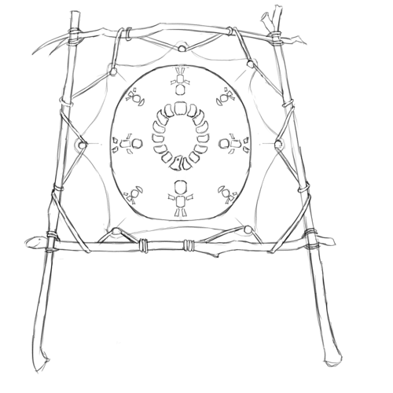

## The Kingdoms of Men

The Kingdoms of Men are a human nation that lies to the northeast of the Dragonshire; it arose from the ashes of the Empire of Man more than a century after it had collapsed.

[[abstract]]
|
|A feudal society, composed of many (mostly-)Human kingdoms tied together by a complex web of custom, alliance and treaty.
|
|---
|
|#### Major Character: Kass Ahnaff, High King
|
|Kass Ahnaff is the current High King.
|He has ties of business and noble bond throughout the Dragonshire, and trade with the Commonwealth has made him wealthy.
|He supports a closer alliance with the Commonwealth, even to the point of allowing non-Humans to purchase land and do business in the Kingdoms (he might say that it certainly doesn't seem to have hurt the Commonwealth much).
|
|Unsurprisingly, the Commonwealth Council would much rather see Kass Ahnaff on the Kingdoms' throne than any of his nearest competitors, and are investing heavily in making sure that he stays there.
|
|His throne is in Merchantmen City (below).
|
|#### Major Character: Mela, Tenna King
|
|Mela Tenna is the current king of the Kingdom of Tennec; his throne is in Hate's Hold (below).
|He is the most powerful Eastern King, and the de facto head of their movement.
|
|He has openly declared his hatred of all non-Humans — including the Haffa, as well as every Human citizen of the Commonwealth, whom he views as traitors.
|(He utterly loathes Kass Ahnaff, who he views as the greatest race-traitor in the Kingdoms.)
|He has led a series of bloody purges of any remaining non-Humans in the Kingdom of Tenna; he promises similar purges in the entire Kingdoms of Men should he attain the Throne, to be followed by a war of annihilation on the Commonwealth.
|
|He has recently become a devotee of the One who Chose Us.
|
|If anyone is unambiguously evil, it's Mela Tenna.
|
|---
|
|#### Major City: Merchantmen City
|
|Known as Annhallan in Royal and Merchantmen City in Commonwealth Standard, this city of 900,000 sits in the northwest of the Kingdoms, about 140 *demarc* \[roughly 588 kilometers\] from the border with the Dragonshire, sitting scarcely a *demarc* from the coast of the Glass Sea.
|Annhallan is the capital city of the Kingdom of Anaff; since Kass Anaff is the current High King, the city is currently also the center of government for the Kingdoms of Men.
|
|As the name Merchantmen City implies, the Kingdom of Anaff has long prospered by trade, especially with the Commonwealth; traders from Heartland Province and the Dragonshire are common, and many of hte Commonwealth's languages are spoken in Merchantmen City.
|
|#### Major City: Hate's Hold
|
|Called Tenlan in Royal, Hate's Hold is the capital of the Kingdom of Tennec; it is a city of 800,000 in the southeast of the Kingdoms.
|It lies on a river, less than two *demarc* \[8km\] up-river from the the coast of the Glass Sea, and a mere 160 *demarc* \[672km\] from the open ocean.
|
|With convenient river access to the Glass Sea, Tenlan is a wealthy trade town; their wealth and power are bolstered by a system of weirs and water-channels that water the surrounding territory, which they control and charge for access to.
|The Tenna are among the wealthiest (and most convicted) of the royal families of the East; as such, Tenlan is the unofficial capital of the Eastern Kings.
|
|Tenlan is also the center of the worship of the One who Chose Us in the Eastern Kingdoms.
|
|The city is called Hate's Hold for a reason; it is not a good place to be if you aren't Human.
|
|#### Major City: The First Throne
|
|Called Hanman in Royal (and Old Imperial), First Throne is one of the Three Cities that came together to found the Old Empire.
|Though it is still a large and prosperous city — situated on the large River Hanem, it has always been a center of trade — it is no longer a center of power within the Kingdoms.
|It has a population of 350,000.
|
|The name First Throne is not figurative: the first and oldest-known cities where founded by Humans; though Hanman is not one of these oldest cities, it is believed to be the first city to hold a *throne*—to develop a regional government.
|
|The city is in the Kingdom of Enha, although the Enhan Kings are relatively weak; the city is ruled by the Hanman Congress.
|So far, both the Enhan line and the Hanman Congress have been content to cooperate (for the most part), and enjoy the prosperity that comes from their prominent location and rich trade.
|The Enhan Kings are allies of the Annhallan and the Western Kings; the Hanman Congress are divided.
|A plurality are supporters of the Western Kings, but other blocs support the Certan cause, direct Commonwealth alliance and the Eastern Kings, in roughly that order of size.
|
|#### Major City: Certa
|
|Certa is a city of 650,000; located roughly in the middle of the Kingdoms of Men, it is the center of the Certan Movement, an anti-monarchist movement.
|Certa has been rebuilt on the site of an older (and smaller) city; the city was destroyed more than a century ago, and was claimed by the Certanis and rebuilt some 38 years later — 62 years ago.
|
|The city is roughly circular; it is divided into pie-slice-shaped districts by prominent roads that run from the central administrative district to the outer wall.
|The city is built with a distinctive, modern architectural style; the buildings are built high, supported by free-standing buttresses, and are decorated with wide windows and prominent artwork.
|
|The Certanis are described in more detail below.
|
|---
|
|#### Language: Royal
|
|Royal is the language of the Kingdoms of Men.
|Like Weal, it is distantly derived from Old Imperial, the language of the Empire of Man, but almost a thousand years have passed since the two languages began to diverge, and they are now quite dissimilar.
|
|*Group HHED*

### beginning

They are Kingdoms in more than name alone; the society consists of a
large number of local nobles, tied together in a complex web of
allegiances.  At present, there are 23 kings as such, more than 35 independent landed nobles (though some of their territories are no larger than a town), and more than a hundred noble families besides.

The allegiances that bind the Kingdom together are very fragile; they can shift, form and break all too quickly.
Because of this, the Kingdoms' politics can be incredibly treacherous, as different power-blocks jostle for control.

Only sometimes can one King credibly claim rulership over all (or just
*enough*) of the Kingdoms to claim the title of High King---and such a High King's rule is often tenuous, as they will never be without enemies, rivals and usurpers.

There have been three High Kingships in the Kingdoms' history.
There first High Kingship lasted from CY 255 to CY 281; this short-lived dynasty collapsed 10 years after passing form its founder to its first heir, rent apart by an internal power struggle. The second High Kingship lasted from CY 361 to CY 435; these High Kings were substantially more warlike, and were in constant conflict with both the Dragonshire to their east and the Goblin Kings to their South.  The second Kingship collapsed after a series of disastrous military adventures between CY 429-CY 433.  The third High Kingship began in CY 695, and has lasted to the present day.  This High Kingship had good relations with the Dragonshire, and now has good relations with the Commonwealth.

The Kingdoms can be roughly divided between their western and eastern halves.  The western Kingdoms are relatively open; they have benefited heavily from trade with the Commonwealth, and have little interest in conflict with their wealthy and powerful neighbor.  Unsurprisingly, the present High King hails from a city-state in the western Kingdoms.

The eastern Kingdoms are far more cruel; the Three Cities that built the Empire lie in the eastern portion, and to this day many of the residents there are quick to believe that humans should hold dominion over all other races (and that those whose ancestors built the Empire should hold dominion over all other humans).

The current High King is one Kass Ahnaff, who is the king of the city-kingdom of Annhallan (styled as Wise Westking and Merchantmen City in Common).
Merchantmen City is in the Western Kingdoms;.
Kass has enthusiastically pursued better relations with the Commonwealth, and has made only the barest pretense to disguise his willingness to cooperate with the Commonwealth to combat the nobles of the East who would see him deposed.
Many easterners view Kass as the worst human being alive.

### The Kingdoms' Economy

The Kingdoms are a relatively wealthy and sophisticated society, particularly in the West, where they have benefited heavily with trade with first the Dragonshire, and later the entire Commonwealth.
During the peace that has prevailed between the Commonwealth and the Kingdoms since CY 695, merchants have crossed the borders between the Commonwealth and the Kingdoms, enriching communities on both sides; notably, rivers running east from the Worldspine give Commonwealth merchants easy access to the many ports on the Glass Sea, the large inland sea that separates the Kingdoms of Men from the Goblin Empire.

Knowledge also crosses the border, as scholars and innovations from the Dragonshire often cross into the Kingdoms, and vice versa.

Unfortunately, this thriving trade does put strain on the east-west divide within the Kingdoms; Commonwealth traders seldom venture into the Eastern Kingdoms, and so the wealth produced by trade is concentrated in the west.

### Other Races

The Kingdoms of Men is a government of men, in their traditional territories; with few exceptions, they have not treated with the other races that may have dwelt within their borders, and instead have displaced them; any that remain are not recognized and citizens, but can only ever be subjects of the Kingdoms.

There is one notable exception; the Kingdom of Haffa in the northwest.  Elves and humans are nearly unique in that they are able to interbreed, although these hybrids are usually sterile (and often suffer other ailments); the half-human, half-elven population of much of Haffa, including the noble line that rules the kingdom, are exceptions to this rule---they are not sterile, and do not commonly suffer any other ailment from their mixed blood.  (It is rumored that magical intervention may have been required to achieve this; whether this is true---and if so, what that intervention was, or what price was likely paid---has been lost to history.)

Unsurprisingly, the Haffa are enemies-by-necessity of the Eastern Kingdoms, who view them as mongrels and half-breeds at best; the Haffa are strong supporters of the current High King and his line.  Notably, though, they usually have no special affinity for tribal Elves living within the Commonwealth's borders, and to the west of the Worldspine.

A particularly grim moment in the history of the Kingdoms' relations with an attempt launched in the Eastern Kingdoms to exterminate their indigenous Kobold population; this led to a mass exodus of Kobolds from the entire Kingdoms.  A few scant pockets of Kobold populations remain in the Western Kingdoms; some settled in the Dragonshire, owing partly to their ability to speak the Drakes' language; far larger number settled deep under the Worldspine; and many more still continued on to the Haven Isles.  In the Commonwealth, Kobolds have prospered and become numerous; this is not the least of the reasons that the Commonwealth views the Eastern Kingdoms as their enemy.

### The Military

Rapid improvements in the quality and availability of steel plate armor---in both the Kingdoms and the Dragonshire---have been the major driver of military tactics in the Kingdoms.  The Kingdoms have sophisticated-enough metallurgy that they can produce large numbers of weapons and armors made of high-quality steel, but they cannot produce it on the scale that the Commonwealth can, and so steel plate armor in particular remains primarily the province of knights (who are often drawn from the ranks of the noble and the wealthy).

Knights are among the most iconic of the Kingdoms' combatants; horse-mounted human Knights in full plate are mobile, heavily-armored and difficult to strike, making them a devastating force on the battlefield.  Many of the kingdoms have long traditions of horse-back riding and archery; because of this, besides mounted Knights, the Kingdoms can boast large numbers of skilled light cavalry and archers---especially masters of the devastating-though-difficult longbow.  In recent years, however, the prominence of longbow archers has fallen away, as the Kingdoms now commonly arms its peasant infantry with easy-to-use and powerful crossbows.

In its early years, each noble and each kingdom was responsible for contributing to the Kingdoms' military from their own resources; though the Kingdoms where often capable of fielding a large and effective army, they could suffer from inconsistent standards of equipment, composition and discipline.  One innovation achieved during the interregnum between the Second and Third High Kings was a standardization of the kinds of combatants that each kingdom was expected to furnish.  Though the *enforcement* of these standards is still subject to the Kingdoms' internal politics, their military is nevertheless far more consistent and unified today than it has been in centuries past.

The Kingdoms typically view their Knights as their most elite and powerful combatants, and they are typically the centerpiece of their military strategy.  After the Knights, their light cavalry and archers are their most prominent forces.  They often field a small number of professional infantry, who they place at the front of their lines, and support with larger numbers of mercenaries, mustered peasants and even conscripted prisoners; unsurprisingly, the discipline, morale and effectiveness of the last two categories can vary widely.

Though not a fact that is often spoken aloud---especially in the Eastern Kingdoms---the Kingdoms of Men are entirely militarily overmatched by the Commonwealth.  Though the Commonwealth cannot boast the large number of Knights that the Kindgoms can, the Commonwealth is richer, has better access to steel, is *much* larger, has a much larger professional military, and can draw on the much greater physical strength of Gnolls and Drakes.

The Kingdoms, however, *are* a match for their neighbor to the south, the Goblin Empire, which led the Goblins in years past to sail south from the Emerald Plane and seek riches (and weaker opponents) on the Ruby Plane.  This influx of wealth (and new source of fighting experience for their infantry), however, has led to a significant improvement in the Goblin Empire's military; this in turn has not escaped the notice of the Kingdoms of Men.

### The Kingdoms of Men and Other Nations

At present, the Kingdoms of Men are at peace with the Commonwealth, and are not at war with the Goblin Empire.
The High King has fostered good relations with the people of the Commonwealth, and the people of the Western Kingdom have prospered from it.
This state of affairs is precarious, however, as many within the Eastern Kingdoms would dearly love to seize the throne---and thereafter to reclaim long-lost territories from the Dragonshire, to lay the Commonwealth and the Goblin Empire low, and to restore humanity to preeminence in the land east of the Worldspine.

They could never achieve this on their own, however, even *if* they could command the undisputed loyalty of all the kings and nobles of the Kingdoms of Men; therefore, the nobles of the East are searching for allies.

The rulers of the West are not ignorant of this---the kings of the far east are seldom subtle in their contempt for non-humans---and so they are seeking allies, too.  And so, the struggle for rule of the Kingdoms of Men has become something of a proxy war between all the great powers of the continent.

If the Easterners can seize control of the Kingdoms, and if they strike an alliance with the Goblin Empire and the Shaded Sea Peoples---even a temporary one---then the Commonwealth is doomed; if, however, the current high-king can solidify his control, then an alliance with the Commonwealth is a possibility---and should that happen, the Shaded Sea People and the Goblinoid Empire would in turn be hopelessly outmatched.

Fortunately for the Commonwealth and the Western Kingdoms, a nightmare alliance between the Shaded Sea People, the Goblins and the Eastern Kingdoms seems unlikely; the Human and Goblin nations have a long history of conflict, and the Shaded Sea People have no significant contact with either; what's more, the Eastern Kingdom's obvious contempt for non-humans would make such an alliance difficult to strike (and impossible to sustain).

[[hook]]
|
|The internal politics of the Kingdoms of Men are one of the major conflicts that drives the plot of Renaissance, and are a major source of plot hooks; the fate of the known world rests in the balance, and there's plenty of room for assassinations, blackmail, dirty tricks and secrets to make a difference!
|
|Players can
|
|* investigate assassinations,
|* blackmail nobles into supporting an alliance with the Commonwealth,
|* assassinate Eastern Kingdoms nobles themselves,
|* discover ancient family secrets — secret shames, ancient contracts, deals with powerful spirits, family curses,
|* discredit hostile noble lines,
|* break up powerful alliances,
|
|and on and on!
|

### The Certan Movement

The Certan Movement is an anti-monarchist movement centered in the city of Certa.
Though centered in the city of the same name, they have risen in power and prestige; they have claimed the territory around the city of Certa, and have begun to spread.
*Certa* is the name of both the movement and its stronghold in Royal; in Common, they are often called King-Slayers or Gold-Bloods (the latter being an epithet).

The city of Certa was built on the site of a much older city, which was destroyed almost a century ago.
The remains of that city where claimed by the nascent Certan movement, and its reconstruction began 62 years ago.
Sitting at the center of the Kingdoms of Men, Certa is a crossroads; it has become a center of overland trade and travel in the Kingdoms, and has risen rapidly in wealth and prestige — though it does suffer somewhat from being several hundred *demarc* from the coast of the Glass Sea.

Besides the city of Certa itself, they also control the surrounding territory — and they are expanding.
So far, they have advanced to the south (toward the coast) and west (into the territory of the Western Kings), displacing local nobles as they go.

The Certa are not a peaceful movement; not all of the nobles that they have displaced have survived.
Though there has not yet been an open insurrection, in recent years, a number of nobles have died (or disappeared) under mysterious circumstances — and others have obviously been assassinated.
Though the Certanis have not yet been proven responsible, they have also not been particularly subtle — particularly considering that much of their expansion has been by expanding into the territories of dead or disappeared nobles near their territory.

[[hook]]
|
|#### Plot Hook: Certa
|
|The Certanis are a destabilizing influence in the already-tumultuous politics of the Kingdoms of Men, which can make them a rich source of plot hooks.
|
|* The Certanis may began an open insurrection; this might provide the Goblin Kingdoms with an opportunity for attack, pull the Commonwealth into a war to defend their Western allies, or — if the Certanis and the West wound each other too badly — place the Eastern Kings in command of the Empire.
|* A noble in the West could die under mysterious circumstances, which various factions in the Commonwealth may wish to investigate.
|* The Certans are a recent movement; the party may simply be dispatched to investigate them — to decide if they're a potential ally or a potential threat.
|* The Certans might not be as guilty as everyone assumes.  Maybe many of the assassinations in the West are actually the result of treachery by Eastern Kings, and they are simply framing the Certans.
|

Though the Certanis are anti-monarchist, they are not particularly egalitarian; wealthy merchants and land-holders have largely stepped into the place of displaced nobles.
Though Certa is nominally a Republic, only those with "a vested interest in the prosperity of the people"—that is, the wealthy, people of business, and land-owners — can actually vote in elections for the *Chamber of Law*, or hold seats in it.
(The *Chamber of Law* is the only house in the Republic that can actually make law; the *Chamber of the People* serves a purely advisory role.)

The Certanis consider themselves natural allies to the Commonwealth — their movement was inspired by their powerful, peaceful and mercantile neighbor.
Unfortunately, the Kings of the West have been the main victims of the wave of political assassinations that is largely credited to the Certanis; given that the Kings of the West are allies of the Commonwealth, this makes any potential alliance between the Certanis and the Commonwealth somewhat fraught.
What is perhaps worse is that some believe that the Certanis may not contain their regicide to the Kingdoms of Men; the Dragonshire also has a hereditary nobility — even if they have largely surrendered power to representative governments.

[[hook]]
|
|#### Plot Hook: Certa's Secret Loyalties
|
|Why *have* the Kings of the West been the Certani's main victims?
|Certainly one possibility is that they're weaker.
|Though the Kings of the West are often wealthier than those of the East, they are also often less militaristic and more mercantile — thus they're more vulnerable to insurrection.
|
|Another possibility is that the Certanis are a cat's-paw; if so, who's agenda are they really serving?
|
|It might be the Kings of the East; they may using the Certanis to weaken and slay the Kings of the West, in a way that the Commonwealth will not rapidly intervene to stop.
|It might be the Goblin Kings, for much the same reason — this may be more likely, given that the Certanis are expanding rapidly towards the coast of the Glass Sea.
|Even more sinister is that the Goblins may be doing this to curry favor with the Eastern Kings.
|It could also be the Leapers; they may have decided to undermine the Kingdoms with guile rather than overt subjugation.
|It might even be a Tempter — or a spirit like them — seeking power for themselves.
|

[[gmguidance]]
|
|#### Defining Certa
|
|GMs have a fair amount of leeway in how they depict Certa.
|
|They might be a cynical movement no better than the kings they're replacing — an *effectively* hereditary ruling class replacing a *directly* hereditary one.
|Or they might be a major positive step for the Empire, despite their flaws — a sincere republican movement that heralds the breaking up of royal power.
|
|Pick a Certa that fits the game you want to run!
|

### The Haffa

The Kingdom of Haffa lies in the extreme northwest of the Kingdoms of Men; it shares a border with the Commonwealth.
Its current capital is called Ehnef in Royal, although it is sometimes referred to as nal'Haffa (literally "Haffa Capital"); it's called Grey-Blood's Weir in Common, named for a spill-over dam on a river immediately to the east that feeds the water-channels that supply the city with water.

The Haffa are remarkable because they are one of the only large populations of half-breeds in the known world.
Elves and Humans are almost unique in that they can (sometimes) produce offspring; these offspring frequently benefit from a kind of hybrid vigor — they are often taller, heavier and stronger than either elves or humans — but they can also suffer from strange, sometimes terrible diseases — ranging from the relatively benign, like bleeding easily or having strange allergies, to the debilitating and deadly, such as irregular growths, tumors or major birth defects.
They are also almost always sterile.

The Haffa are one of only two stable, healthy and fertile populations of Elf-Human hybrids (the other being the Shifters).
The Haffa maintain their health through selective breeding, special medicines, and magical intervention — the exact nature of which is not widely known outside of the Haffa royal line.
(Perhaps unsurprisingly, the Haffan court heavily patronizes physicians, and their healers are renowned throughout much of the world — they are certainly among the best in the Kingdoms.)

[[hook]]
|
|#### Plot Hook: The Secrets of the Haffa
|
|The (secret) magical intervention that the Haffa use to ensure their health is an obvious plot hook.
|What is it?
|Was it a deal struck with a powerful spirit centuries ago, like the one that created the Drakes?
|What spirit was it struck with, and what cost was demanded?
|Or is it on-going, some magical process that requires constant tending — and which could spell the downfall of the Haffa if it is ever disrupted, which their enemies may seek to do.
|

The Haffans politics are determined for them by their blood and their location; they have long been allies of the Kingdom of Ahnaff and the Commonwealth, with whom they share borders, and they are also major supporters of the current High King, Kass Ahnaff, who has been their shelter against the predations of the Eastern Kings.
Conversely, they are despised by the Eastern Kings, who loathe them for their non-human blood; while open conflict between Kingdoms has been rare since the Third High Kingship in CY 695, the Eastern Kings have missed no opportunity to wound the Haffa.

Most recently, between CY 789 and CY 797, the Eastern Kingdoms deployed all their wealth and power to target Lords on the eastern border of the Haffa; after their finances crumbled, the Easterners purchased the Haffans' lands and holdings.
What followed was a time of brutal abuse, as the peasantry that lived in those holds where starved and brutally abused by their new, distant Eastern Lords
As their circumstances became dire, the Haffan peasantry began to revolt; between CY 811 and 814, the Eastern Kings attempted to muster an army to suppress the revolts, but Ayl Ahnaff, Kass Ahnaff's granfather and the High King at the time, refused to raise the Kingdom's army or allow the Easterners to quarter in his territory.
This made it impossible for the Eastern Lords to maintain control, and resulted in their selling their holdings to both the Haffan king and Ayl — the latter out of spite, to keep the Haffan's land out of their hands for as long as possible.
The incident secured the Haffa's loyalty to the Ahnaff line for generations — as well as their deep hatred of the Eastern Kings.

### The Secret Army

[[hook|Secret Army Plot-Hooks]]
|

## The Shaded Sea People

The Shaded Sea People are deadly raiders operating out of the Shaded Sea — a stretch of sea between the southwest Emerald Plane and the Warren Isles.
The Shaded Sea Peoples consist mainly of the Shade Elves of the Shaded Steppes and the Ratfolk of the Warren Isles, united as clients of the Leapers.

[[abstract]]
|
|A warlike nation of raiders, consisting of a the Shade Elves of the Shaded Steppes and the Ratfolk of the Warren Isles, united under the mysterious Leapers.
|
|---
|
|Population: 95M
|
|Common Languages: Keillou, Chatter, Shaded Speech, *the Leaper's language*, *subject languages*
|
|Common Races: Shade Elves (55%), Ratfolk (20%), *subject races*, Leapers (unknown)

### History of the Shaded Sea

#### The Shaded Steppes

Much of the ancient history of the Shaded Steppes is unknown.
The Shade Elves of the Shaded Sea where already a dominant military power West of the Worldspine before settlers and explorers from the Commonwealth entered the region around CY 80.
They where a nomadic, warlike race of horse-riders and herders; they where dominant throughout the Shaded Steppes, and constantly raided and warred with the cultures that bordered on it.
They where fractious; an extended family formed a *clan*, clans formed *rides*, and rides joined in *confederations*.

Those nomadic horse-people had great access to milk, meat, and hide, but where dependent on settled peoples near the Shaded Steppes for everything else.
They where also warlike, and where devastating archers, riders, and raiders; they conquered several other cultures near the Shaded Steppes, forced others to pay tribute, and subject the remainder to nearly constant raiding.

They where unafraid to use extermination and terror as tools of conquest.
If a city or culture resisted, it might be razed and its population scattered or slaughtered.
(This could very somewhat by tribe and confederation, with some being more bloodthirsty than others.)
While this made their opponents more likely to surrender, it also bread intense resentment among their victims.

They where also brutal masters.
Their justice was harsh, with minor infractions frequently being met not only with the death of the perpetrator, but also a large enough collection of kin and neighbors to ensure that a message was sent.
Their duties where also extreme, often leaving client cultures impoverished and starved.
They frequently had no particular concern for clients' ability to survive, frequently treating them as possessions to be used.

Unsurprisingly, the Shade elves where hated by the other cultures of the south-west Emerald Plane, and had no shortage of enemies.

As the Commonwealth moved into the region, many saw a potential ally against a hated enemy.
(The Commonwealth's willingness to ally with other westerners against the Shade Elves also made these people more willing to allow the newcomers to built permanent cities and fortifications in the region; in fact, many of them seem to have been happy to allow the Commonwealth settlers to bear the brunt of the Shade Elf assaults.)
Slowly, a narrow strip of Commonwealth fortifications and walled cities began to stretch west, skirting the northern edge of the Shaded Steppes.

Further west, the Herders, a culture of hunters and herders from the central regions of the west, began to seek allies against the Shaded Steppes.
Though their territory did not border directly on the Shaded Steppes, the buffer between the two was thin; when the Shade Elves power waxed, their raids could reach well into Herder territories.
The Herders began to seek allies to resist the Shade Elves, and found willing partners among other nearby cultures — primarily including a confederation of Gnollish tribes.
This alliance became the aptly-named Herd-and-Pack Alliance.

Finally, in the east, based in a strip of forest running between the Shaded Steppes and the Worldspine, there where the Sunrise Peoples, an alliance of frequent enemies (and sometimes conquests) of the Shaded Sea.
Their fate was frequently the inverse of the Shade Elves: when the Shade Elves where united and their power was at its maximum, the Sunrise Peoples would suffer conquest and pillage; but when the Shade Elves leadership collapsed, the Sunrise Peoples broke free.
(Owing to their long history of conflict with the Shaded Steppes, the Sunrise People have a particular hatred for the Shade Elves.)

#### The Warren Isles

The Ratfolk of the Warren Isles where a race of mariners, fishers, and traders.
It is unknown if the Ratfolk originated in the Warren Isles, or came there from somewhere else; in either case, well before the signing of the New Charter in the eastern Emerald Plane, the Ratfolk had used a variety of single-masted outrigger canoes to spread throughout the Warren Isles.

They established a number of distinct cultures.
Cultural differences slowly developed between islands; on some of the mountainous islands, it was possible for different valleys to be cut off enough from one-another that they could diverge culturally.
Though the Ratfolk practiced forms of agriculture and aquaculture, on many of the small islands, these where inadequate, and so the Ratfolk there relied heavily on fishing; many of these cultures built smaller settlements near the shores — sometimes even on stilts on the shore, or in the sea itself.
On some larger islands, however, agriculture was more successful; there, more urban, settled cultures developed.
Some of these urban settlements became city-states; some of the city-states became conquerors.

Ratfolk city-states began to experiment with seaborne warfare.
Large city-states began to conflict with one another, and to attempt to raid and subjugate the smaller cultures and islands nearby.
This began an exodus from the Warren Isles.
In CY 331, two smaller city-states on the island of *Katlkan* allied against the dominant city-state on the island, *Tetln*.
In response, *Tetln* sought the aid of the city-state *Oyssa*, on its own island 45 *dc* away; the alliance was able to pacify the smaller city-states.
Solidly in control of *Katlkan* and having the support of its closest rival, they then began the systematic conquest of the rest of the nearby Warren Isles.
These conquests triggered an exodus; Rafolk fleeing the *Tetln* conquest landed in the Haven Isles, on the shores of the southern Worldspine (and just south of the Shaded Steppes), and on the northwest Ruby Plane.

#### The Leapers

By CY 200, the Commonwealth had established a number of forts and settlements in the region, and been integrated into its politics.
In CY 255, the Commonwealth encountered the Herders, and the Herd-and-Pack Alliance; the two cultures where natural allies, and not least because of their shared enemy in the Shade Elves.
Over the next century, conflict with the Shade Elves steadily increased; around CY 287, two of the largest Shade Elf confederations merged, forming the *Alenaya Confederation*; this combined entity unleashed a massive army on the region.
In CY 341, the *Alenaya* set their sights on Five Rivers, the largest city of the Herd-and-Pack Alliance (which the Herders called *Kauhnahei*); the Herd-and-Pack Alliance sought the aid of the Commonwealth, who deployed the Bonfire Legion — one of the Commonwealth's armies in Westward — to reinforce Five Rivers.
Between 341 and 344, Herd-and-Pack and their Commonwealth allies repulse several Shade Elf sieges; suffering heavy losses, and without pillage or tribute, the *Alenaya* Confederation began to crumble; as their power waned, the people on the east of the Shaded Steppes, the Sunrise People, began to rebel.

As Shade Elf power crumbled, the *Leapers* struck.
Little is known outside of the Shaded Sea about their methods; as far as is known, the Leapers never raised an army and marched on the Shade Elves.
It is theorized that they systematically harried the crumbling *Alenaya*, attacking their people as they spread out through the steppes to graze; they may also have found eager allies (or pawns) among the confederation's many enemies.
By CY 346, the *Alenaya* had lost the allegiance of all but their original two confederations — and these where in a weakened state, having lost many of their constituent clans to defection and combat; they became tributaries of the Leapers.

In CY 349, the Herd-and-Pack Alliance signed a treaty, and by CY 350 the Commonwealth had begun to settle the Haven Isles.
During this time, from CY 346 to CY 351, the Leapers continued their subtle campaign, bringing most of the other Shade Elf rides under their control.
Though weakened, the Shade Elves where finally (mostly) unified; in CY 357, they set out to reconquer the east of the Steppes, and by CY 361, they set out to bring the Warren Isles under their control.

The Ratfolk that had landed on the shores of the Shaded Steppes in CY 331 where not unknown to the Shade Elves.
Skilled in seaborn combat, they became tributaries and allies of the Shade Elves, and feared raiders along the southern coast of the Emerald Plane.
As the Shade Elves weakened, they became as much allies as tributaries to the Shade Elves, equal to some of the rides in power; at some point before CY 361, as Shade Elven power began to recover, they proposed to ferry members of an allied Shade Elf ride to their former homes in the Warren Isles.

The scale of these raids where limited by the Shaded Steppes rafolks' numbers; they began almost thirty years of conflict between the Shaded Steppes and Warren Isles.
Between CY 363 and 366, the Shaded Steppes had subjugated a nine smaller islands in the northeast of the chain; between CY 374 and 376, a concerted counter-attack by the Warren Isles ratfolk displaced the invaders.
In CY 377, a larger invasion secured more than a dozen islands; by CY 379, the invaders had once again been displaced.
Over the next decade, the Shade Elves and Ratfolk of the Shaded Steppes assembled a much larger force; in CY 389, they once again landed in the Warren Isles, this time with much greater numbers — and possibly with Leaper aide.
After six years of sustained warfare, in CY 395, the Leapers invaded *Tetln* and their allied city-states from below, and conquered them.
The Ratfolk of the Warren Isles became tributaries of the Leapers.

In theory, the peoples of the Shaded Sea — the Shade Elves and Ratfolk of the Shaded Steppes and the Ratfolk of the Warren Isles — where now united under the rule of the Leapers; in practice, the Leapers did not establish any kind of administrative structure.
No one confederation had control of the Shaded Steppes, and *Tetln*'s rule of the Warren Isle had been shattered.

#### The Siege of Islandhome

### The Nations of the Shaded Sea

#### The Shade Elves of the Shaded Sea

The Shade Elves of the Shaded Sea are a culture of nomadic herders and raiders.

#### The Ratfolk of the Warren Isles

The Ratfolk of the Warren Isles are a culture of fishers, raiders and pirates.

#### The Leapers

#### Minotaurs

### People and Places

#### Major City: Western Great Walled Camp

*Western Great Walled Camp* is a literal translation for the city that serves as the informal capital of the Shaded Steppes; it is one of the few permanent settlements constructed by the Shade Elves.
The name is literal: the city is located in the west of the Shaded Steppes, and is constructed as a great walled camp; whereas other cities have permanent buildings and districts, much of Western Great Walled Camp is simply an open field, where the members of the dominant Confederation can encamp.
The city is enclosed by four strong walls, joined at irregular angles; the north and west walls are shorter, and surround the palace complex and the city's four permanent districts, while the south and east walls are longer, and surround the open encampment.
The city has two major roads, one that runs roughly east-west and another that runs roughly north-south; it has six gates, four situated where one of the roads meets, and two more on the south and east walls leading into the encampment.

The city includes a palace complex, where the current ruler of the Shade Elves and their Clan reside.

#### Major City: Eastern Great Walled Camp

A great walled camp in the East, where the *Kena* Confederation is based.

## The Raptors' Protectorate

The Raptor's Protectorate is, like the Commonwealth, a vibrant alliance of many peoples, and the strongest (native) nation on their Plane.
Unlike the Commonwealth, however, they are not an enlightened alliance of peaceful expansion and voluntary inclusion; instead, they are an alliance of necessity, formed centuries ago to resist raids by the Shaded-Sea People, and now absorbing the refugees created by the Goblin Empire's conquest of the Ruby Plane.

[[abstract]]
|
|An alliance formed between the Raptors and Ratfolk of the Ruby Plane to resist the Shaded-Sea Peoples; more recently, they've absorbed waves of refugees from the Goblin Empire's conquests.
|
|---
|
|Population: 135M
|
|Common Languages: Protectorate Standard, Brook, Ember, Songspeak, *refugee languages*
|
|Common Races: Raptors (63%), Ratfolk (13%), Brightfeathers (6%), *refugee populations*

### History of the Raptor Empire

#### The Raptor Empire

The Raptors have long been the dominant race throughout the mountainous jungles of the central Ruby Plane, divided into diverse tribes and cultures.
Around CY 40, the *Terrace-Builder* Raptors built their first large cities in the northeast regions of the Raptor's Peaks, the mountain-range at the center of the Ruby Plane.
They mastered the construction of terraces, and use them extensively both for urban construction and agriculture.

The early settlements developed into city-states, supporting a highly-structured society.
They were broken into *castes*: roughly, *rulers*, *administrators*, *soldiers*, and *farmers*.
Their society was controlled by *rulers* and coordinated by the *administrators*.
All land was held by the *rulers*, and granted to villages and their *farmers* for use; food was collected by the *administrators*, stored in a vast network of storehouses, and distributed to the populace as needed.
The *soldier* caste served a role much like the Guards do in the Commonwealth: a small cadre of full-time warriors, who patrol and secure the Terrace-Builder's territory during peace-time and serve as the disciplined elites at the core of their army during war-time.

> **Eager**: Because we have a ruling caste, you might think that our city-states work like throne-cities in the Kingdoms of Men; actually, they work a little more like the city-states of Heartland Province.
> Although they often have one main ruler, like a queen, that ruler typically shares power with the rest of the *golden caste*, and relies on them to administer the city.
> My people tend to be very good at making sure that everyone is "bought in," and so the kinds of palace intrigues that you see in the Human and Goblin Kingdoms are rarer among the Terrace-Builder Raptors.
>
> **Aryn**: "Golden caste"?
> The rulers, I guess?
>
> **Eager**: Yes, I'm sorry.
> "Ruler," "administrator," "soldier," and "farmer" are what the castes are called in Commonwealth Standard; we call them *golden*, *clay*, *bronze*, and *stone*.
>
> **Chandra**: Also, you said "queens."
> I guess your people are more matriarchal, like mine \[Drakes\] are?
>
> **Eager**: Yes.
> Like you, females tend to be dominant in our society.
>
> **Notebook**: I'm curious, why are farmers the "stone caste"?
>
> **Eager**: Because of the stone terraces we use.

The Terrace-Builders used a system of *corvee labor*: individuals where required to spend one out of every eight days contributing labor to one of the city-state's projects, which could include constructing or maintaining roads and irrigation channels, or serving as a soldier.
(The Terrace-Builders use an 8-day week, with 7 days for labor and one day for rest.
A Raptor might be called for corvee labor on any given labor day; typically, the administrator-caste will schedule the local farmer-caste according to the needs of local projects.)
This allowed the Terrace-Builder city-states to build a vast network of roads, storage-houses and planted terraces,  spreading out from their city-states and tying them together.

Eventually, an alliance of two Raptor city-states — Giant's Stairs and River-Cutter's City — came to prominence and, over the following centuries, slowly built an empire.
Their conquests where subtle, using a mix of careful diplomacy, military threat, and small-scale skirmish.
The Terrace-Builders rarely sought the total destruction, ruin, or conquest of their opponents, nor did they carry away slaves or loot cities; instead, they used military action as a tool for extracting tribute, trade, and other concessions, gradually bringing others under their influence.

(Notably, the Terrace-Builders often presented themselves as the lords of the Raptors, claiming that they could call up the Raptor tribes in the south and west.
In fact, those tribes had their own distinct cultures, and in many cases where just as much a conquered people as anyone else.)

Becoming a subject of the Terrace-Builders was not without benefits: it provided access to their extensive network of roads, and to the trade that they carried; it provided access to the protection of the Terrace-Builder Empire and the soldier caste; and it meant that Terrace-Builder storehouses would be built throughout the subject people's territory.
For these reasons, some nations became subjects of the Terrace-Builders voluntarily.
Even those peoples and territories who where conquered, however, where granted access to the benefits of being a subject of the Terrace-Builders; this was done in order to better integrate all the subjects of the Empire.

By approximately CY 390, the Terrace-Builder had assembled a substantial empire, centered on their city-states in the mountainous north of the Ruby Plane, and running north to the coast, east into the lowland jungles and deserts, and further south into the Raptor's peaks.
This empire consisted of many different subject peoples, some of which had been incorporated voluntarily, while others had not; this put the *rulers* caste in the position of managing a large, heterogeneous empire, whose subjects may not have been entirely subjugated, pacified, or assimilated.
In order to maintain control, they had to manage a careful mix of diplomatic, military, and economic pressures.
They also had to play the different parts of their empire against each-other, using one faction as a counter-weight to another — an art which the *rulers* caste mastered.

Unlike the Shaded Sea Peoples or Goblin Empire, the Terrace-Builders relied as much on the good will of their subjects as on military force to ensure the stability of their empire.
Because the Terrace-Builders never carried away slaves or looted cities, and because membership in their empire carried significant benefits, they where not hated by their subject peoples the way the Shaded Sea or Goblin Empire are.
(Of course, this is not to say that every subject people became a willing participant in the empire, nor where the Terrace-Builders where above deposing a troublesome monarch.)

#### The Ratfolk Arrive

The Ratfolk had long lived in the Warren Isles.
They where excellent mariners; centuries before their exodus to the Ruby Plane, they had used a variety of small, single-masted outrigger canoes to expand throughout the Warren Isles.
They where a society fishers, farmers and traders.
Many of these cultures where small, and they where often quite distinct from one-another; in some cases, different valleys on the same island could have highly distinct cultures.

Beginning in CY 331, several larger Ratfolk cities united, and began the conquest of their neighbors; this started an ocean-born exodus, with many Ratfolk fleeing the Warren Isles.
Some of these exiles reached the southern Haven Isles, while others landed on the southern Emerald Plane, and still others landed on the northwest coast of the Ruby Plane.
Ironically, some of the Ratfolk who landed in the southern Emerald Plane became allies and tributaries of the Shade Elves; in CY 346, they ferried those devastating raiders back to the Warren Isles.
Shade-Elven raiding of the Warren Isles only intensified the Ratfolk exodus.

A large Ratfolk population came to settle on the northwest corner of the Ruby Plane.
These refugees brought with them a variety of distinctive but related cultures; they also brought relatively sophisticated technology — unlike much of the Ruby Plane, they had mastered the use of iron, for example.
Many of these cultures where mercantile; settled on the Ruby Plane, they began to heavily exchange, and to further develop.

This area was far from the borders of the Raptors' Empire, and was only sparsely populated — they where separated from Giant's Stairs and River-Cutter's City by a thick jungle, and then by rugged Raptor's Peaks.
Over time, a unique Ratfolk culture developed, with their own cities — notably, this culture was more urban and agrarian than their island-bound kin.
This culture made allies among the locals — including the Brightfeathers, a parrot-like race that lived in the lower, jungle-covered reaches of the northwest Raptors' Peaks.

Eventually, the Ratfolk began to trade with several of the Raptor tribes that lived in the southwest flanks of the Raptor's Peaks — tribes that where tributaries of the Terrace-Builders' Empire.
This brought them into (indirect) competition with the Terrace-Builders, as they where weakening the Terrace-Builder's hold over the Raptor tribes, and thus reducing the Empire's potential military might.

#### The Shaded Sea Attacks

In CY 454, the Shaded-Sea People — the Ratfolk of the Warren Isles and the Shade Elves of the Shaded Steppes, united under the Leapers — began to attack the northwest Ruby Plane, falling most heavily on the Ratfolk there.
The Ruby-Isles Ratfolk sought out the aid of the militarily powerful Raptor Empire, offering to become tributaries if the Empire would protect them.
The Raptor Empire, long used to juggling a vast empire of only weakly-bonded peoples, offered the Ratfolk favorable terms: military aid, in exchange for the Ratfolk's nominal submission, and access to their prosperous markets.

The Raptor Empire marched west, and helped the Ratfolk resist the Shaded Sea raiding.
In 456, the Shaded-Sea Ratfolk had established a permanent military encampment on the Ruby Plane; by 477, the Raptor Protectorate had pushed the Shaded-Sea Peoples off the Ruby Plane entirely — though their seaborn raiding would never completely cease.

#### Prosperity

For centuries, the Raptor Empire prospered; the terrace-builder Raptors cut roads through the mountains and jungles, and allowed goods to flow from the Ratfolk in the west to the Raptors in the east.
The Terrace-Maker Raptor's society was dramatically altered; trade with the Ratfolk made them wealthier, and that wealth made them more mercantile.
While they still use a system of corvee labor, they pay their citizens a small wage collected from trade; they also allow their citizens to purchase their way out of corvee labor.
In turn, a *merchant* class has developed, who trade profitably with other cultures and purchase their way out of corvee obligations.

#### Contact with The Goblin Empire

In CY 617, Goblins first established a settlement on the northeast Ruby Plane.
In CY 703, the Goblin Empire was formed, and they began their sack and conquest of the Ruby Plane in earnest.

As the Goblin Empire conquered their way inland from their foothold on the Ruby Plane, members of the cultures and races that the Goblins conquored sought the protection of the Raptors.
Soon, the Raptor Protectorate began to swell with the refugees of the Goblin's conquest.

#### The Present

Today, the Raptor Protectorate is a wealthy and powerful civilization, the preeminent native power on the Ruby Plane.
They benefit from the military might (and deft politics) of the Terrace-Builder Raptors, and the mercantile skill, seafaring talent, and relative sophistication of the Iron-Worker Ratfolk.
The empire has also seen a massive influx of refugees from the Goblin Empire's conquest, which they strive to settle in the relative safety that exists within the Protectorate's borders.

The Protectorate faces powerful enemies on two fronts.
In the east, a devastating war with the Goblin Empire draws ever closer; so far, at least, the Goblin Empire has avoided direct conflict with the Protectorate, but their armies draw ever closer to the Protectorates' borders.
In the west, the Iron-Worker Ratfolk are subject to constant, devastating raids by the Shaded Sea Peoples.

### Culture

The Raptor Protectorate is composed of wide variety of cultures from throughout the northern and central Ruby Plane — though its two dominant cultures remain the Terrace-Builder Raptors, who lead the Protectorate and provide most of its military might, and the Iron-Worker Ratfolk, who remain the drivers of their economy.

#### The Terrace-Builder Raptors

The Terrace-Builder Raptors continue to use a distinctive system of terraces for agricultural production in the highlands of the Raptor's Peaks.
They also continue to construct and occupy some of the largest urban centers on the Ruby Plane.
Their systems of caste and corvee labor also survive — although they have changed.
Their leaders are still drawn from the *rulers* caste, and their administrators are still drawn from the *administrators* caste.
Members of the *soldiers* caste still form the elite troops of their armies; they are trained in war from their youths, and serve their city-states as labourers when the army is not active.
Farmers, in turn, work the terraced fields, and serve as craftsmen in rural settlements.

The inclusion of the Iron-Worker Ratfolk in the Protectorate brought profitable trade, and with it chnage.
The "tribute" that the Iron-Workers pay to the Terrace-Builders is minor, but profit from trade with them is significant; the Terrace-Builters also charge a tarrif on goods carried over the extensive network of roads that they maintain through the Raptor's Peaks at the center of the Ruby Plane.
Much as the city-states collected the agricultural product of the terraced farms and distributed food among their citizens, now they collect tribute and tarrifs from trade, and distribute this among their people — minus a portion claimed by the city-states themselves.
This means, in practice, that the city-states are well-funded, and that those doing corvee labor now receive a modest wage.

To encourage profitable trade and useful craft, most Terrace-Builder city-states allow members of the Soldier and Farmer castes to purchase an exemption from certain corvee duties.
This directly adds to the city-state's coffers, but it has also enabled the development of a profitable professional class of merchants and artisans within the Terrace-Builder's city-states, and further brisk trade with the distant Iron-Workers Ratfolk.
This, in turn, has allowed the Terrace-Builders to import a number of the innovations that the Ratfolk brought to the Ruby Plane.

[[fiction]]
|
|> "Corvee labor!"
|> The Terrace-Builders are the bulwark that protects the Ruby Plane from the Goblin Empire and Shaded Sea — and our likely allies! — so we'd like to think the best of them.
|> So we use a nice, technical term for it: "corvee labor."
|>
|> But it's slavery.
|> Someone from the Administrator caste shows up, backed up by some soldiers, and forces you to build a road through the steaming jungle.
|
|*Fire-Watcher, a scholar from the Dragonshire in the Commonwealth*
|
|> I can say I never thought of myself as a slave.
|> I think we thought of ourselves as citizens doing our duty, to maintain the roads that we travelled and the fields that fed us.
|> And I can point out at least one important difference between what I was, and what the slaves of the Goblins are: I was allowed to leave.
|
|*Eager, a Raptor who emigrated to the Commonwealth.*

Much ancient Terrace-Builder construction used fieldstones, though most major construction in modern city-states is done using carefully dressed stone masonry — often limestone.
The use of brick construction is also common, especially for minor buildings and in villages outside of citystates; they are often face with mudbrick.
Thatch is often used for roofing, and ornamentation is rare.

Raptor buildings are often designed for communal use.
Many buildings are large and open, without internal walls; sheets of thick fabric are used for doors and internal partitions.

In the mountains and foothills, the Terrace-Builders often lay their cities out in terraces; they often exploit natural defenses, building walls only at the entrances to valleys, for example.
In the plains to the extreme east of the Empire, they sometimes use a more regular, level city-plan, with walls all-around.

Raptors use a 6-day week, with the precise schedule varying by caste; for example, the Farmer caste works three days in the field and two days for the city-state, and has one day off.
The sixth day begins with a short ritual meal, but is otherwise left to the citizen.

Terrace-Builder Raptors have spent centuries riding herd over an empire consisting of diverse peoples; they tend to be very open, and they are welcoming to members of strange new races and cultures.
Members of countless different races can be found in the prosperous markets of the Terrace-Builders' city-states.
However, it is not easy for an outsider to find a permanent place in their culture: their caste system influences every part of their society, and it is not easy to operate among them without a caste affiliation (and an outsider — especially a non-raptor — cannot easily claim a caste).

#### Iron-Worker Ratfolk

The Iron-Worker Ratfolk are a culture of skilled traders, sailors, fishers and metal-workers.
Their industry is one of the major drivers of the Protectorate economy; fish, crab, iron, and steel from the Iron-Workers is traded in markets throughout the rest of the Ruby Plane, carried along the coast by ships and across the mountains by the Raptor's roads.

They live throughout the northwest of the Ruby Plane, in large cities and small fishing villages.
Iron-Worker Ratfolk commonly build homes and small buildings on stilts; this allows them to build in wet lowlands, sometimes even on the shore or in the water directly.
Despite their expertise with iron, when they build near water, they frequently do not use metal nails; instead, they primarily use jointes and dowls, and replace parts of their homes as they weather.
On drier ground, they build more traditional homes — timber-framed, well-braced, nailed together, and faced with stucco so that they can resist rain and weathering — although usually still constructed on stilts, in order to handle heavy rains and runoff.
When they have enough dry ground to work with, Iron-Worker Ratfolk also build underground; at the extreme, they have been known to reclaim mine and quarry space for use as fortifications.
When Iron-Workers build underground, they often face interior surfaces in brick and stucco to seal out moisture, and often build narrow drainage-paths into their rooves and walls; their underground structures are often reinforced, in order to handle the added weight of rain-soaked ground.

Ironworkers have a great need for fortifications, as piracy and raiding from the Shaded Sea remains a constant problem.
Most settlements of any size have some kind of fortification, whether small wood-stake fortifications constructed by small communities on the coast, or large-scale sub-surface constructions with fortified entrances in higher ground.

Iron-Workers are experienced seafarers.
They use a variety of boats to sail the coasts for trade, and to venture into the sea to fish.
These include small canoes; to larger single-masted boats, like catamarans and outrigger-canoes; to larger, two-masted boats.
Even their larger, dual-mast boats have flat bottoms and a shallow draft, the better to navigate shallow coastal waters and land on shores.

### Economy of the Raptor Protectorate

### Military of the Raptor Protectorate

### The Raptor Protectorate and Other Nations

The Raptor Protectorate has no shortage of enemies: the Goblin Empire presses on the east, and the Shaded-Sea constantly attack the west.
Pirates from the Shaded Sea directly attack the Protectorate on its western shores, raiding Ratfolk and Brightfeather villages built on or near the shore;

### Languages

#### Language: Protectorate Standard

[[abstract]]
|
|The common language of the Protectorate, derived from a Ratfolk pigin.
|
|Group: Any
|
|Partially Intelligible: None

The common language of the Protectorate, Protectorate Standard derives from a pigin that Ratfolk refugees used to communicate with the Raptors that lived near the coasts.
As other races sought to trade with the Protectorate, they developed their own variants of the pigin; today, in effect, there is an abstract 'core' language, which all the pigins share, and which each race uses a unique set of sounds to pronounce.

The language is the primary written language of exchange and scholarship in the Protectorate; it uses a variant of the Ratfolk's alphabet.

#### Language: Brook

[[abstract]]
|
|The language of the Terrace-Builder Raptors.
|
|Group: DDK
|
|Partially Intelligible: None

The language spoken by the Terrace-Builder Raptors, named for the way it sounds — like a burbling brook, or small rockslide.
Originally, Brook was written pictographically; after the Ratfolk and Raptors began to trade heavily, a phonetic encoding was developed using the Ratfolk's alphabet.

While not a difficult language to learn to speak, it is difficult to learn to read the pictographic form of the script, because fluency requires the reader to memorize more than a thousand pictographs.
Unsurprisingly, the use of the alphabetic script has become more common, and fluency in the old pictographic script has declined.

Mastery of the logographic form has become something of a status symbol, since most old and important documents are written with the logographic script.

#### Language: Ember

[[abstract]]
|
|The primary language of the Iron-Worker Ratfolk.
|
|Group: GR
|
|Partially Intelligible: Chatter (-20), Cqik (-30)

Ember is the common language of the Iron-Worker Ratfolk; according to legend, it got its name because it reminded a Terrace-Builder ruler-caste of the sound of a crackling fire.
It does make use of a sound not present in either Chatter or Cqik, a "pop" or "snap" sound produced with the tongue.

While spoken Ember is similar to several other languages spoken in the Warren Isles before their exodus, its written form is unique.
It uses an alphabetis derived from an alphabet used in the eastern Warren Isles, that all but vanished from the Warren Isles after that Ratfolk culture was subjugated and extinguished by their kin.
Notably, several other cultures on the Warren Isles have adopted a variant of this script for their own use.

#### Language: Songspeak

[[abstract]]
|
|Songspeak is mimicry-based language of the Brightfeathers.
|
|Group: *Mimics*
|
|Partially Intelligible: None

Songspeak is the language of the Brightfeathers.
It makes heavy use of the Brightfeather's uncanny mimicry; many words are represented by directly mimicking a sound associated with the things being referenced — "fire," for example, is represented by the sound of cackling embers.
While some other words are formed by combining basic syllables — after all, what sound does a star make? — there is no standard list of syllables for their spoken language; while there are roughly thirty common phonemes, there are at least as many more that appear in at least one common word.

Their written language is almost as difficult to learn.
Before the Iron-Workers came, the Brightfeathers used about a hundred pictographs; after the ratfolk came, they adapted a variant of the Ratfolk's script to encode the common syllables of their spoken language.
Today, Songspeak "script" consists of about a hundred pictographic "glyphs" for common words, plus 28 characters (mostly adapted from the Iron-Worker Ratfolk's script) used for their common syllables, plus 36 "strokes" that are based on a part of a common pictograph; the letters and strokes are combined in a flowing calligraphy, interspersed with pictographic glyphs for common words.
Making things even more complicated, the pictographs are often used *representationally* — that is, to illustrate a concept, not according to the rules of a language.

> **Fire**: "Used representationally?"
> What does that mean?
>
> **Eager**: It means that they use them like parts of an illustration, not according to the rules of a language.
> For example, I once saw a Brightfeather draw the glyph for a tree, leave a space, then draw "tree" again, to represent a clearing.
>
> **Fire**: Seems like that'd be hard to interpret.
>
> **Eager**: It can be, but I think it suits the literal Brightfeather mind.

## The Goblin Empire

Goblins have long dwelled in the southeastern reaches of the Emerald Plane, their culture ruled by Kings and Warlords — and infamous for the sale and brutalization of intelligent beings as slaves.
Since the rise of the Dragonshire — and especially since the Kingdoms of Men reformed from the remains of the Empire of Man — the Goblins have been the weakest major power in the East.

Their fortunes have changed dramatically since the creation of the Goblin Empire and their conquest of the Ruby Plane.

[[abstract]]
|
|A society with several power-centers, all cooperating under the aegis of the Empire to plunder the Ruby Plane.
|
|---
|
|#### Major Character: Second-Empress.
|
|Her name in High Goblin can't be transliterated, but in Speech-of-the-Lesser, she is simply called Second-Empress; she is the daughter of the first Empress.
|She rules the Goblin Empire, and is leading their pillage of the Ruby Plane.
|So far, she has successfully kept the Kings, Warlords and rising merchant class sweet, while slowly but steadily advancing the power of the Empire.
|
|---
|
|#### Major City: Strong-Throne
|
|Strong-Throne is the capital of the Empire, located in the south-center of Goblin territory on the Emerald Plane.
|The city has a population of roughly 450,000, contains the Imperial throne, and is the center of their administration and military command.
|
|#### Major City: Market-of-the-Empire
|
|Market-of-the-Empire is a city of more than a million located only 70 miles from the Imperial frontier on the Ruby Plane.
|The city is not a seat of Imperial administration; rather, it is a center of trade and business; here, slaves and pillage from the frontier are traded for coin and supplies from the Emerald Plane.
|Perhaps as few as 300,000 of the city's occupants are resident citizens; they are joined by another 300,000 traders, travellers and transients, and between 400,000 and 800,000 slaves.
|
|---
|
|#### Language: Classical Goblin
|
|Classical Goblin is a language of law, governance and scholarship; it is an ancient, formal form of the language, preserved in the written Code and used throughout the Goblin legal system.
|
|Goblins have an unusually wide vocalization range, and their language spans all of it.
|Few other races can speak it — which suits Goblin cultural values.
|
|*Group GR+DDK*
|
|#### Language: Vulgar Goblin
|
|Vulgar Goblin is the form of the Goblin language in use today.
|Vulgar Goblin has borrowed from the languages of many of the races that they have encountered (or enslaved) over the centuries.
|
|Conveniently, much like Commonwealth Standard, Vulgar Goblin often forms new words by combining existing ones; this means that many words and place-names can be nicely rendered in Commonwealth Standard.
|
|*Group GR+DDK*
|
|#### Language: Speech-of-the-Lesser
|
|Speech-of-the-Lesser is a language designed to be usable by a large number of races, with diverse types of speech.
|It works much like Commonwealth Standard: it uses a number of abstract sounds, which speakers substitute for sounds that they can make.
|
|Notably, Many Goblins do not speak Speech-of-the-Lesser — in their minds, it is not the job of the *greater* to make themselves understood to the *lesser*.
|This task often falls to slave-tenders — often Gremlins or low-born Goblins — who speak to their betters in Goblin and the slaves they manage in Speech-of-the-Lesser.
|
|*Any Group*
|

### Kings, Warlords, Emperors and the Code

Goblin society is ruled by Kings and Warlords.
Kings control cities, towns and territories — the means for food, industry and trade.
Warlords, in turn, control bands of Goblin fighters.
Kings jostle amongst themselves, forming alliances and competing for power, but they also compete for the services of warlords; kings' arrangements with warlords are openly mercenary — there is little pretense of honor, loyalty or higher causes — and they can be extremely fragile.

Unsurprisingly, rule in Goblin society can be extremely unstable.

This does not have as great an impact on Goblin society as it could, however, because law and commerce are not administered by their Kings; instead, they have a parallel legal system, founded in the Code, and administered by Judges.

#### The Code

Originally called the *North Coast Code,* the Code was a formalization of the customs used to govern trade between several cities on the southern coast of the Glass Sea — the sea between the Kingdoms of Men and the Goblins.
Though it was only originally intended as a trading agreement between a handful of cities, it began to spread; though it doesn't claim to be ordained great spirits, destiny or fate, it has nevertheless come to occupy a central place in Goblin society.

The Code has evolved over the centuries; eight major schools of legal scholarship have developed, and each has accepted modifications to the Code itself — the Code never claimed to be unmodifiable, although no procedure for amending it was specified.
In general, there is little competition between Schools; Goblins tend to view each of the schools as being equally valid, thinking of them much like the way that members of the Commonwealth think of different provinces.

Judges as such are few: there may be only three or four in a city of five thousand.
They have the support of clerks, scholars, and Enforcers — though the ranks of the Enforcers will be fewer than the forces of local Kings and Warlords, they are numerous enough to enforce the Judge's judgments on the populace.
Those who appear before Judges can hire Advocates — scholars of the law who specialize in pleading before Judges.
Advocates' skills are highly valuable, and they are often important, powerful and wealthy members of their communities.

#### Kings-by-the-Assembly

The Second High Kingship of the Kingdoms of Men (CY 361-435) was particularly warlike, and cost the Goblin Kingdoms heavily.
In CY 377, an unprecedented step was taken: several desperate northern Kings called their peers to an assembly, with the purpose of selecting one among their number to lead their combined forces, the better to resist the Kingdoms of Men.
In early CY 378, the First king-by-the-Assembly was appointed.

The First King-by-the-Assembly had the loyalty of most Kings — and could exploit the internal peace to buy most Warlords — and was able to rally stronger resistance to the Kingdoms; however, they where still overmatched.
The first King-by-the-Assembly served until CY 417.

The only other King-by-the-Assembly ruled from 541 to 563; the line ended when the king's daughter was assassinated less than 6 months after taking the throne.

The Third High Kingship of the Kingdoms of Men (CY 695), the peace between the Kingdoms of Men and the Dragonshire (beginning in CY 698), and the incorporation of the Dragonshire into the Commonwealth at the signing of the Commonwealth Compact (CY 744) spelled the end of the Goblins as a major power on the Emerald Plane; the new Commonwealth was far too vast, wealthy and powerful for the Goblin Kings to compete with.

#### The Empire

Goblins hailing from southern kingdoms first sailed far enough south to reach the Ruby Plane in CY 538; they found in the northeastern Ruby Plane an arid land, populated by relatively primitive people — a land the could plunder, full of people who would be their slaves.
Goblin sailing techniques rapidly improved, and by CY 617 they had established a permanent outpost on the northern shore of the Ruby Plane.

In CY 703, the Noble Assembly once again appointed a ruler — this time an Empress.
She was given the power to assembly an Empire — to raise taxes, to build an Imperial administration, and to levy the forces of the kings and warlords and place them under her command.
She was given this power for the express purpose of efficiently conquering and plundering the Ruby Plane.

The Goblin Empire has seen a rapid rise in the Goblin's fortune.
They have conquered a large swath of the northeast Ruby Plane, displacing, enslaving or exterminating many of the native races in the process.
The territory on the Ruby Plane is now larger than their territory on the Emerald Plane — though they still rule this territory from the Emerald Plane.

In characteristic style, modern Goblin society has at least three centers of power, all of them cooperating only slightly more than they compete: The Imperial administration rules their society, but only so long as it has the consent of the Kings — that is, only so long as it enriches the Kings with treasure plundered from the Ruby Plane.
The Kings, in turn, try to keep the Empire on a short leash, giving it no more power than it needs to coordinate the conquest of the Ruby Plane.
And through it all, the Judges remain, ruling on matters of law and custom.

### The Economy — and Slavery

Slaves have long been one of the chief resources of the Goblin economy — the North Coast Code specifically granted Goblins the right to take any non-Goblin as a slave, and very few scholars of the Code have questioned this provision or called for change.

Acquiring slaves on their home plane grew more and more difficult as the other peoples and nations of the eastern Emerald Plane grew stronger; it effectively became impossible with the signing of the Commonwealth Compact, as they could no longer risk the wrath of the Commonwealth.

The Ruby Plane has become the chief source of slaves and plunder, and the economy of the Goblin Empire now revolves around the conquest and exploitation of the Ruby Plane and its people; this transformation has brought the Empire unprecedented wealth and prosperity.

### The Imperial Military

Goblin metal-working has long lagged behind that of the Kingdoms of Men and the Dragonshire; owing to their long talons, awkward hands, and stiff bone-plated backs, they have never been able to ride horses well; and the forces of Kings and Warlords are often highly heterogeneous — and almost always reinforced with slaves.
All of these factors have meant that the Goblin Kings have long lagged behind the other militaries of the Emerald Plane.

Still, they are not without advantages.
Several Goblin Kingdoms have cultivated expertise in chemistry, alchemy and medicine, and they have used these skills to turn their slave ranks into forces to be feared.

They have also used their time on the Ruby Plane wisely.
Though the troops levied from Kings and Warlords may vary widely in tactics, composition and quality, the Empire has reorganized them into regular units, drilled them, and deployed them together; this has led to rapid improvements in their coordination.
The Empire has also experimented with new technologies — they are the only power besides the Commonwealth to experiment with guns and cannons.

#### The Infantry

Goblins commonly use large formations of infantry equipped with long spears or pikes.
The first two ranks carry shields: the first rank will fight kneeling, with their spears braced at their feet and their shields readied, while the second rank fights standing and holding their shield up — though also with their spears braced.
The ranks behind them fight with their spears or pikes held overhead, attacking by thrusting.

These pike-wielding formations can be extraordinarily deadly, but they are also very vulnerable if they are flanked; for this reason, support is essential.
The flanks of these formations are often guarded by ranks equipped with crossbows or hand-cannons — Goblins are not well designed for the use of bows, but they can use guns and crossbows effectively.

Goblins do not field heavy cavalry the way the Kingdoms of Men do — although they do field deadly light cavalry.
Gremlins do not have long talons interfering with their ability to grip, they do not have bony plates impeding their flexibility, they are light enough to ride two-to-a-horse, and — vitally — they can be trusted enough to play a vital role in a fighting force, unlike other slaves.
Gremlins ride two-to-a-horse, typically in light armor, carrying guns or crossbows; though they are almost incapable of mounting a charge like mounted human Knights can, they make deadly skirmishers and archers.
Because there is a separate jockey and crossbow-wielder or cannoneer, they can fire effectively while moving at speed; because they are so fast and mobile, they can close to a much shorter range without feer of being effectively engaged — even by enemy archers.
And because they are so lite and quickly, they are particularly effective at running down an enemy who breaks; this capability is very important, as it has allowed the Goblin Empire to turn many partial victories into devastating routes.
Sometimes, these light cavalry will carry man-catchers, nets, bolos and other weapons designed to debilitate and capture fleeing enemies; a future of misery and slavery awaits those so captured — and wealth and reward awaits the Gremlin who captures many future slaves.

When operating in smaller units, Goblins often field a single formation, of mixed pike-wielders and crossbow-wielders.
Each rank will be a mix of pikes and crossbows; in the first two ranks, the pike-wielders will also carry shields.
When the enemy is at range, the crossbow-wielders will stand next to the pike-wielders; the pikes will cover them with their shields.
As the enemy closes, the crossbows will step back into the pikes, who will close ranks in front of them; if the enemy engages the formation in melee, the crossbows will fight with their talons.
This requires careful coordination; if order collapses, the results are likely to be catastrophic.
The Goblin Empire drills these formation often, and is careful to arrange troop rotations so that all of their infantry have experience deploying these tactics in combat.

Though Goblin Kings have long made use of slave rabble in their military tactics, the Goblin Empire is less willing to do so; the loyalty and reliability of slaves recently acquired from the cultures of the Ruby Plane remain a serious concern.
Still, some generals do press slaves into service — especially members of larger and more battle-capable races; these slaves are often paid a wage and afforded better treatment, the better to secure their loyalty.

#### Cannons, Hobgremlins and Other Experiments

For centuries, with few exceptions, Goblins have lagged behind both the Commonwealth and the Kingdoms of Men in military technology.
In an effort to close this gap, the Empire has been using the Ruby Plane as a kind of military laboratory, testing out new technologies and tactics against inferior enemies.

One such technology is the use of gunpowder weapons.
The Goblin Empire is one of two major powers in the known world to experiment with guns and cannons — the other one being the Commonwealth.
The Goblin Empire had hoped that these weapons would provide a powerful edge in their conquest of the Ruby Plane; while they have indeed been a powerful advantage, they have not provided the edge that the Goblins hoped.
Guns are powerful, but they are, in many ways, unnecessary: none of the races or cultures that they have conquered have made heavy use of heavy metal armors, so guns provide no great advantage over conventional bows and crossbows.
Similarly, though cannons *have* proved to be devastating seige weapons, the designs available to the Goblin Empire are not portable or wieldy enough to be effectively deployed against infantry; this limits the advantage that they provide in open warfare.
Cannons are also expensive, and impose a significant baggage train.

Hobgremlins are a more gruesome innovation.
Hobgremlins represent an attempt to close the gap in physical power between Goblins and other, larger races, without relying on (sometimes unreliable) slaves in battle.
Hobgremlins are alchemical creations, created by the magical, surgical and chemical manipulation of Gremlins; the procedure is gruesome, and the results are horrifying.

Hobgremlins are indeed much more physically imposing than Gremlins or Goblins; they are often as large as Gnolls, and even stronger and tougher.
They often possess other advantages as well, like potent natural weapons, venoms, thick hides or acute senses.
Horrifyingly, they are often mentally *reduced* as much as they are physically enhanced; the procedure is only useful if it produces warriors that the Goblins can trust and control more than a typical slave, so Hobgremlins are often mentally crippled, and conditioned to be loyal to their Gremlin tenders and Goblin masters.
This crippling can sometimes involve physically lancing parts of the brain, a procedure that leaves the Hobgremlin an invalid — if they survive at all.
The alchemical processes that create Hobgremlins can also be unstable; they may suffer deformity and illness — deadly allergies and strange addictions are common.

Though the process has not been completely abandoned, its use has declined — and it was never widespread.
One reason is that the results are unreliable; it can be frustratingly difficult to keep Hobgremlins healthy, and the damage to their minds limits their use on the battlefield.
Even more dangerous — though the Empire may never admit it — was the impact that it had on Gremlins in the Empire.
Gremlins where horrified by the process, and deeply resented the degradation being visited upon themselves and their kin — so much so that at least one Gremlin doctor involved in the experiments defected to the Ruby Alliance.
The Empire feared that, if the experiments continued, they might face a Gremlin uprising — a terrifying prospect, as the Empire is dependant on Gremlin slave-handlers to function.

Now, Hobgremlins are rarities, produced only by the most secure or most foolish Goblins.
Even more rare are similar experiments on other races; these rarely end well for the Goblins involved because, while the specimens created are powerful, they are also much less "sympathetic" to their Goblin masters than Trusted Gremlin slaves.

#### The Navy

The Goblin navy is vital for connecting their territories on the Ruby Plane with their homeland.
This navy is primarily a defensive and logistical force — protecting their landings, ferrying troops and equipment from the mainland and riches back home.

### The Goblin Empire and Other Nations

While the Goblin Empire has made no peace overture to the Kingdoms of Men or the Commonwealth as such, they have avoided any conflict with those powers.

The Goblin Empire is, of course, an enemy of the Raptors' Protectorate, and the two are at war; indeed, the very mission of the Protectorate is to provide a safe refuge from the predations of the Shaded Sea Peoples and the Goblin Empire.
So far, however, direct conflict has been minimal: the Protectorate lags behind the Empire in technological sophistication and military capability, and so they have focused on securing their borders and integrating and arming their refugee populations.
(And there is still a substantial "buffer zone" of unfortunate civilizations between the Raptor's Protectorate and the Goblin Empire.)

The Commonwealth has been slow to form an alliance with the Raptors' Protectorate — they are slow to start a war that may consume half a continent on another's behalf — but sympathy for the Protectorate is strong in the Commonwealth, and relations between the two have been strengthening.
The Goblins know that such an alliance is coming, and that they may lack the diplomatic means to stop it; in recent years, they have begun to prepare to fight a war on two fronts.

Even though the Commonwealth has not yet formally allied with the Protectorate, they have long meddled in the affairs of the Goblin Empire — through spies directly commissioned by the Commonwealth Council, and through the tacit support of organizations like the High Road.

While some of the Goblin's kings have sought allies among the kings and nobles of the Eastern Kingdoms, such overtures have not yet been fruitful, and the Empire has not yet given them its official support; the southern Human Kingdoms have long been enemies of the Goblin Kings, and the Kings of the East are slow to forgive.

The Goblins have little contact with the Shaded Sea Peoples, as a continent separates the two (and because the Commonwealth patrols the seas between South-Harbor and the Ruby Plane, cutting off an ocean route).

## Deep-Explorer Dwarves

Deep-Explorer Dwarves are an offshoot of the shallow-digging Dwarven culture of the North; highly individualistic, they fled their kin when the Mindsharing movement began.
"Deep-Explorer" is their formal name in Commonwealth Standard; they are also sometimes called Caver Dwarves or Ground-Explorers, and their name for themselves is *Drahrat*—a swipe at the Mindsharing Dwarves, or *Fahrat*.

[[abstract]]
|
|An enigmatic Dwarven culture that lives in caves deep underground; their extent of their settlements and resources is unknown.
|
|---
|
|#### Notable Outpost: Shade-Root
|
|"Root-of-the-Shade-Tree" is the (awkward) formal name in Commonwealth Standard of a small Dwarven outpost near Triumph; it is often shortened to Shade-Root.
|The entrance to the outpost is at the end of a small natural cave that branches off of the Carved Road.
|
|The outpost is a maze; though (some) of the walls have been bricked-over and (some) of the floors have wooden platforms and walkways, the outpost is still built within the confines of a twisting, turning natural cavern.
|Their front gate turns back on itself before leading to a main cavern 90 *strides* \[75m\] across; small shops and residences surround the walls: some may be free-standing structures, though others are merely facades over cave entrances.
|
|As is usual for a *Drahrat* settlement, visitors are not allowed outside of the "main" cavern; the full extents of Shade-Root are unknown.
|It is unknown how the outpost acquires (or produces) food, how they get out of the cavern (they make little use of the Carved Road), where their stores are kept, or even how many *Drahrat* actually live there.
|
|---
|
|#### Languages: Drahrat
|
|The Drahrat speak their own language, which developed from *Ehanud*, the Dwarven language spoken by the confederation of holds form which they departed.
|
|*Group HHED*
|

### History of the Drahrat

Early in CY 509, a psychically-reactive fungus was discovered underneath an island in the Haven Isles; experiments with this organism eventually spawned the Mindsharing Dwarves, or the *Fahrat*.
This new Dwarven sub-culture was greeted with extreme skepticism by some; among the most extreme were the movement that would become the Deep-Explorer Dwarves — or *Drahrat*—who vanished into the depths to flee their Mindsharing cousins.

The Deep-Explorer Dwarves originated in the *Lun*, a federation of several Dwarven holds dug into the low peaks at the northern end of the Worldspine Mountains.
They where (and still are) relatively insular, and where not among the Dwarven clans that joined the Commonwealth.

Descendants of another confederation 9 *demarc* \[38km\] to the East had left more than a century prior to settle in the Haven Isles, and it was there that psions and philosophers studying the *Fahra*, the mindsharing fungus, settled.
As the properties of the Fahra where explored, and as a movement began to develop around it, the insular and individualistic *Lun* began to fear what the *Fahrat* might become, and began to seek escape.
Their fear was great enough that they sought a shelter that the *Fahrat* could never breach, even if they should consume the entire surface: they dug into the depths.

The *Drahrat* began to explore the depths in CY 517.
More of their civilization moved underground over the following decades: by CY 533, their culture had mostly moved underground.
Their surface settlements, now highly fortified, where little more than trading posts and support hubs.

Little more is known about the history of the enigmatic *Drahrat*.

### The Drahrat Today

The *Drahrat* reveal little of themselves, and little is known about them.
It is unknown where or how the *Drahrat* produce or acquire food; how they travel form settlement to settlement; where their stores are; how they acquire or produce the goods they trade; or even how many of them there are or where their populations reside.

The Drahrat have breached the surface at several other far-flung points; like their former homeland, these constructions are heavily fortified and lightly populated, serving as little more than trade-posts for surface dwellers.
The Drahrat have also constructed outposts near the settlements of other subterranean races, notably near several Clay Men holds and Kobold cities; trade with these outposts provide other races' only insight into the Drahrat society.
All known Drahrat settlements are built in natural caverns, with little artificial excavation.
They also make heavy use of natural materials — and, conversely, little use of worked materials.
Drahrat settlements are constructed out of wood, plant matter, hide, bone and scale — and with little use of metal, glass or carved stone.
One notable partial exception is a type of brick that they make by preparing and baking a fungus-root; it is believed that this is intended as a deliberate insult to the *Fahrat*.

Though the *Drahrat* are willing enough to trade with other races, outsiders are not allowed outside of their market-squares.
They often offer exotic natural materials for trade, like those they use in their own construction: strange foods, unusual medicines, and the bones, hides and scales of unusual creatures.
They also offer goods acquired from far-flung cultures, although how they move goods from the Ruby Plane to the Emerald Plane (for example) is unknown.
The *Drahrat* have also mapped extensive networks of caves, and sometimes offer the use of these caves in trade.

They appear to have some mechanism that allows them to pass under the Worldspine mountains, and to reach the Haven Isles and Ruby Plane as well; whether they have dug their own underways (like those constructed by Kobolds) or have built something like the Commonwealth's Kairne Network — or perhaps a mix of both — is unknown.
It is suspected that they have a larger population that they have revealed, that they have access to water and some kind of farming, and that they have larger cities that they have not revealed — although whether this is true and what form any of them may take is unknown.

[[hook]]
|
|#### Plot Hook: Secrets of the Deep-Explorer Dwarves
|
|Obviously, the secrets of the Deep-Explorer Dwarves are rife with plot-hooks.
|
|* If the Leapers find a way to breach the Deep-Explorer Dwarves unknown transit method — be it a tunnel like the Kobold's Underway or a Kairne-like network — then every *Drahrat* settlement might suddnely become a Shaded Sea People invasion-corridor.
|* Less dramatically, if the Leapers take a *Drahrat* settlement, then they might have access to the *Drahrat*'s unknown transit-path; the *Drahrat* may turn to the Commonwealth for aid in fighting off this common enemy.
|* A hook that goes back before role-playing games existed, the *Drahrat* may find something deep underground — something dangerous, something they can't control.  This might be as simple as a giant flaming monster, as insidious as a mysterious organism taking them over (ironically enough), or as strange as an ancient carved totem of inscrutible power and origin (or some other out-of-context problem).
|

The full extent of their military resources are unknown, but their defences appear impressive.
In CY 795, a Shaded Sea raiding party broke into the Carved Road and attacked the settlement of Shade-Root (see above); this allowed several Commonwealth traders caught in the settlement's market a rare glimpse into the *Drahrat*'s formidable defences.
Like almost all *Drahrat* settlements, Shade-Root is built into natural caves, with very little artificial excavation; because of this, every passageway is narrow and twisting, lines of site are limited, and there are countless natural choke-points.
When the attack occurred, the *Drahrat* ruthlessly exploited these natural defences by blocking off these narrow passages and blind curves with massive shields mounted on wheeled carriages; they then fired repeating crossbows from behind these fortifications.
Invaders struck by these bolts fell rapidly even when their wounds where minor, which lead some of the witnesses to suspect that the *Drahrat* where using poison.

## Foam-and-Cloud

Foam-and-Cloud is a Goblinoid government spanning part of the Horizon Islands — an island chain in the Great Gulf.
The chain has three large islands; one has recently been claimed by the Commonwealth, and has been substantially fortified, while the other two — and most of the smaller islands of the chain — have been claimed by the Turquoise Kings, the Kings of Foam and Cloud.

[[abstract]]
|
|A Goblin kingdom in the Sea of Strife between the Emerald and Ruby Planes; they have been changed radically by assimilating values and customs from their Commonwealth subjects.
|The High Road operates here with impunity.
|
|---
|
|#### Major Character: the Sand-Shelled King
|
|The Sand-Shelled King is the current king of the Kingdom of Foam and Cloud.
|He is the latest in the line that founded the Kingdom more than two hundred years ago, the line of the Kings-of-Bronze.
|
|Despite being a Goblin king, he speaks fluent Commonwealth Standard, and is sympathetic to the Commonwealth.
|
|---
|
|#### Major City: Hurricane
|
|Hurricane was the largest of the cities founded by Goblin settlers; it was the city where the Bronze King made his home, and established his throne.
|The Bronze Kings have since moved their throne to Winds-of-Gold, but Hurricane remains a cultural center for the Goblin population on the island; it is still strongly aligned with the Bronze King.
|
|It is located in the southeast of Cloud Island, and has a population of 350,000.
|
|#### Major City: Winds-of-Gold
|
|Winds-of-Gold was a large, wealthy city on the southern coast of Foam Island; it was the third city to fall to the King of Bronze, and the second to accept tribute to end his seige.
|The Bronze King was carful to ensure the quick recovery of the wealthy city and its profitable markets; it has since become the largest city in the islands.
|The Fourth Bronze King moved his throne to Winds-of-Gold in CY 651, and the city is still the capital today.
|
|The city sits on the south shore of Foam Island and has a population of 550,000.
|
|---
|
|#### Languages
|
|Countless languages are spoken in this small island kingdom.
|Commonwealth Standard (Any), Heartland Gnoll (GR), and Weal (HHED) are all common in Commonwealth-descended communities.
|High Goblin (HHED+GR), Speech-of-the-Lesser (Any), and Vulgar Goblin (HHED+GR) are all common in Goblin communities.
|Commonwealth Standard and Vulgar Goblin are the two most common languages.

### History of Foam-and-Cloud

Nearly four centuries ago, between CY 534 and CY 561, the islands where settled by both Commonwealth and Goblinoid explorers; at the time, reaching these islands was difficult, and the colonies had little support from their parent cultures.
Conflict could be fierce, but it was also limited; neither side had substantial military resources, and the Goblins where outnumbered.
In fall of CY 559, the Goblin politics shifted violently against the King of Bronze, who collected what remained of his holdings (and the handful of fighters he could convince to defect from their various Warlords), and departed the Emerald Plane entirely; he arrived in the Horizon Islands scarcely ahead of winter.
Over the course of winter, he quickly assumed control of the Goblinoid settlements in the Horizon Islands; when Spring came, he launched a campaign against the Commonwealth settlements.
Through a series of sieges and campaigns, he was able to subdue all of the Commonwealth settlements by CY 568 — some he took out-right, though others he forced into tribute.

The King of Bronze did not loot or despoil those cities.
He could not count on the mainland for supplies, and he did not have complete control of many of those cities — and, perhaps wisely, he knew that the Commonwealth cities had more vibrant economies than the Goblin ones, and he wished to keep those economies intact.
Instead, he allowed those cities to continue much as they always had — notably, exempting them from slavery under the code — so long as they accepted his rule, and payed his tribute.

This arrangement has evolved over the centuries.
The Standard-speaking and Goblin-speaking societies have cross-pollinated extensively; notably, the Commonwealth-descended population proved to have notably better education and administration systems, and so the Bronze Kings came to rely almost exclusively on Standard-speaking administrators and scribes — with the notable exception of the Code, which is still solely the province of Goblins.

The Standard-speaking, Commonwealth-descended communities grew more rapidly than their Goblinoid counterparts; over the next 20 to 30 years, they became the major source of local production, wealth and food for the Bronze Kings.
The Goblinoid communities, in turn, became more divided: some Goblins adopted some of their Standard-speaking neighbors' customs and values, and began to prosper with them; other, more conservative Goblins saw their power erode.

As ocean-going technology became more sophisticated, trade with the Emerald Plane increased — with both the Commonwealth and the Goblin Kings.
The Islands' Goblin King and Code-mediated trade system made trade with the Goblin Kings on the Emerald Plane more favorable, and provided a mechanism for conservative Goblins to retain wealth and power.

As the Goblin Empire's pillaging of the Ruby Plane has accelerated, one might expect the Goblin Kingdom of the Foam and Cloud to become an important and prosperous cross-roads of the Empire — but that has not happened.

### Slavery under the Turquoise Kings

Part of the arrangement between the King of Bronze and the Commonwealth communities who surrendered to him was that their citizens would not be taken as slaves; the King of Bronze honored this agreement, and, under his descendants' rule, the fate of slavery in the Horizon Islands has waned.
As some Goblin communities where influenced by Commonwealth customs — and as the Commonwealth-descended communities have grown wealthy and productive, and have become vital to the fortunes of the Kings of Bronze — opposition to slavery has grown stronger and stronger, and the institutions of slavery have eroded.

In CY 577, the King of Bronze formally restricted the taking of slaves from any of the islands' Commonwealth communities; in CY 586, he passed laws restricting the abuse of slaves; through CY 591 to CY 617, his daughter passed further reforms governing the treatment of slaves; and in CY 651, the Bronze King's great-grandson restricted slavery on the island only to those whose parents where already slaves, or who came from the Goblinoid Kingdoms with their owners — a condition that applied to fewer than a 800 people on the island.

Under these rules, the only remaining slaves on the islands are those who come from the Goblinoid Kingdoms on ships, and a small population of Halflings living in a traditionalist enclave on the Island of Cloud — the southernmost of the two large islands in the chain; they are effectively forced into servitude because they are the only Halflings in the island — they must either marry into slavery or die out.
They live deep within large, defended Goblin manors, jealously guarded against the outside; so isolated, they serve an almost symbolic role.

They are guarded so jealously because the High Road operates almost freely on the islands; they enjoy wide support among both the Commonwealth-descended and Goblin communities, and the tacit approval of the current King of Bronze.

[[hook | Plot Hook: The High Road and the Turquoise Kings]]
|The Kingdom of the Foam a Cloud is a battleground in the High Road's fight against slavery, and this provides countless opportunities for adventure.  Players can liberate slaves, slay slaveholders, steal into the Goblin Empire, pick up valuable intelligence, and more.
|
|Though the number of Goblin families left that still hold slaves is few, they are wealthy and powerful — making them excellent villains.

### The Kingdom of Foam and Cloud

The Kingdom of the Foam and Cloud is a Goblinoid Kingdom; the Turquoise Kings have a seat in the Noble Assembly, and their Goblin communities are ruled by the Code — the title *Turquoise Kings* itself is derived from a series of carved turquoise chips commissioned in CY 694 and given to the School of the Code on the Island of Cloud.

It is an unusual Kingdom.
In CY 703, the first Turquoise King voted against the formation of the Empire, and — though they are still Goblin Kings, subjects of the Code — they have not contributed to the Empire or accepted its rule.
Slavery has almost been extinguished there, with the full support of the islands' Judges.
Though they still trade with the Goblin mainland, many merchants will not sail to the islands — out of fear that their slaves will be seized and liberated.

The culture there is neither purely Goblinoid nor Commonwealth; it is a hybrid that has been forged over more than 250 years.
Commonwealth Standard, Vulgar Goblin, Speech-of-the-Lesser, Weal and Heartland Gnoll and more can all be heard in the kingdom's lively markets; Goblin scholars of the Code argue law with the elected leaders of Commonwealth communities; and Goblins, Gremlins, Humans and Gnolls dine together on feast-days.

[[gmguidance | Using the Kingdoms of Foam and Cloud]]
|Full of allies even though it is nominally enemy territory, the Kingdom of the Foam and Cloud is very useful in intrigue-focused games in the Goblin Empire.
|In particular, it makes an excellent starting-point for an adventure into the Goblin Empire: Commonwealth Standard is spoken there, commonwealth currency spends there, and its easy to sail from the Kingdom to Goblin holdings on both the Emerald and Ruby Planes.

Their king is a most unusual Goblin King.
Like much of his line, he speaks fluent Commonwealth Standard, and is an avid consumer of the Commonwealth's culture; indeed, he picked "Sea-Plated King" as his name in Standard, as an homage to the "Sea-Scaled King," a character from a popular play in the Dragonshire.
He also embraces many of the Commonwealth's values, and openly pursues trade with them.
He is also no friend of slavery: it is widely believed that he will completely outlaw slavery before passing rule to his chosen heir, his second son.
The High Road also operates freely in his Kingdom; though he does not patronize them directly, he makes no attempt whatever to restrain them, and provides no solace or comfort to slave-holders or slave-catchers.

[[gmguidance | Using the Turquoise King ]]
|The Turquoise King is likely to be highly sympathetic to a player party operating in his Kingdom, providing them with a powerful advantage.
|He is not a supporter of the Empire and he detests the practice of slavery;
|while he likely cannot openly support the player party — he is constrained by the conservative flank of his court, who are still wealthy and powerful — he will also make little or no effort to restrain them on their likely missions.

### Major Character: the Sand-Shelled King

The Sand-Shelled King is the current king of the Kingdom of Foam and Cloud.
He is the latest in the line that founded the Kingdom more than two hundred years ago, the line of the Kings-of-Bronze, the Turquoise Kings.

Despite being a Goblin king, he speaks fluent Commonwealth Standard, and is sympathetic to the Commonwealth.

### Major City: Hurricane

Hurricane was the largest of the cities founded by Goblin settlers; it was the city where the Bronze King made his home, and established his throne.
The Bronze Kings have since moved their throne to Winds-of-Gold, but Hurricane remains a cultural center for the Goblin population on the island; it is still strongly aligned with the Bronze King.

It is located in the southeast of Cloud Island, and has a population of 350,000.

### Major City: Winds-of-Gold

Winds-of-Gold was a large, wealthy city on the southern coast of Foam Island; it was the third city to fall to the King of Bronze, and the second to accept tribute to end his seige.
The Bronze King was carful to ensure the quick recovery of the wealthy city and its profitable markets; it has since become the largest city in the islands.
The Fourth Bronze King moved his throne to Winds-of-Gold in CY 651, and the city is still the capital today.

The city sits on the south shore of Foam Island and has a population of 550,000.

## Mudskipper Federation

The Mudskipper Federation is a loosely-aligned chain of tribes and families that spreads through the running water of the Ruby Isle.
Though they spread slowly, they are far-flung, and can be found in wide, slow-running rivers and freshwater lakes (so long as they refuse to fall stagnant) throughout the Ruby Plane.
Each river — and what tributaries and nearby lakes that can be settled — is governed by a tribe.
Tribes, in turn, are often rife with sub-divisions, almost like a nation in miniature.

[[abstract]]
|
|A fractuous society of amphibious beings that dwells within the lakes and rivers of the Ruby Plane.
|
|---
|
|#### Major City: River-Wall
|
|River-Wall is the name given to a mighty waterfall in the depths of the Ruby Isle, two major rivers joining at the peak of a cliff, descending deep into a sinkhole.
|At it's base is an aquifer-linked lake.
|A grand Mudskipper city — their capital city, by virtue of hosting the Confederation's meeting-place — is built into the waterfall and lake.
|Stone and rammed-earth structures stretch out from the very peak of the waterfall, hung in sweeping cricles.
|The waterfall's water is co-opted to fill them, with the flow carefully controlled and managed through valves and reservoirs.
|The uppermost structures are for public use — they are markets, meeting-spaces, and the Federation Chamber; smaller residential spaces descend from the hanging public spaces.
|
|The Federation Chamber are where the leaders of the various Mudskipper tribes meet to discuss the affairs of the Confederation as a whole.
|
|Wise elders manage a library of carved tablets and carefully curated, waterproofed scrolls, and Shamans placate the major spirits of the River Wall and the watery networks that the Mud-Skipper call their home. Spreading the spiritually-hued stories of their distant past for teaching the next generation.
|
|---
|
|#### Language: 'Skipper
|
|The language of the Mudskippers.
|Mudskippers can only vocalize underwater, which makes the sound of their language unique.
|
|*Group MS*
|
|#### Language: 'Skipper Sign
|
|The gestural language that Mudskippers use to communicate on land.
|
|*Group Humanoid*

### Mudskipper Communities

Mudskippers are roughly-humanoid beings who inhabit the rivers, lakes, and subterranean aquifers of the Ruby Plane.
They strongly prefer flowing water, and are well adapted to function in a current.

[[hook]]
|
|The Mud-Skipper prefer flowing water, to avoid the stagnant pools of the Judges.
|The black slime colours many of their myths and serves as a 'satan' figure — even though Mud-Skipper themselves are (slightly) more resistant than most to their influence.
|

[[hook]]
|
|The Mudskippers dwelling within the underground aquefers of the Ruby Plane may have contact with the Drahrat.
|This would for trade in unique and rare goods, and for the cross-polination of ideas, for travel to distant lands, and for cooperation against their enemies.
|Or, equally, it might lead to conflict and mistrust between the two races.
|Or even a mixture of both, varying from tribe to tribe.
|

Mudskipper towns are built underwater in the rivers and lakes in which they live — though they occasionally feature some guest rooms that open above-water for visitors.
The layouts of their villages follow the flow and twist of the river; their buildings are built in a teardrop cross-section, with windows letting the river current flow through, impeded as little as possible.
They avoid large structures, holding town halls and meetings in large, cleared spaces, and keeping their homes only for medicine, meals, meditation, and rest.

Though not a universal trait, Mudskippers tend to be matriarchal, and prize leadership qualities in their female young.

Mudskippers are highly devout in their offerings and worship of the spirits of the world around them, especially the major spirits governing the rivers they live in — though they are hesitant to attempt to bind or bargain with them.
They are also highly reluctant to discuss the reasons for this relationship.

[[hook]]
|
|Why would a race so devoted to the spirits be so afraid to bargain with them?
|What event from their past has made them so wary?
|What threshold would have to be crossed for them to seek the intervention of the spirits?
|
|These mysteries are left to the GM to supply!
|

### The Mudskipper Federation

Most of the Mudskipper tribes have joined a loose union, the Mudskipper Federation; this is led by a council of the leaders of the various tribes, the Mudskipper Council.
The Federation provides a forum for the various tribes to cooperate on large projects, or to make decisions that affect them all.
The Federation does not, however, unite the tribes, rule them, or claim to speak for them — to the point that one tribe may be a Protectorate member, while a neighbouring tribe engages in a guerilla war against the Protectorate to stop overfishing.

[[hook]]
|
|The Mud-Skipper are fractious and intensely tribal; individual tribes may be members of the Protectorate, the Commonwealth, or even allied with Cloud-and-Foam.
|Obviously, this provides ample opportunity for intrigue, infighting and tribal politics.
|

[[hook]]
|
|A change in a river's path can be a political upheaval for the Mud-Skipper, on par with a civil war elsewhere.
|Even moreso if the change is the result of a natural event, or a spirit's whim, instead of mortal intervention.
|

### Mudskippers and Other Nations

Generally, Mudskippers are more than happy to keep to themselves.
They have limited agriculture and aquaculture, and prefer hunting and foraging throughout the watery networks of the ruby isle.
Mudskippers are surprisingly willing to share the waterways that they call home; most tribes only conflict with their land-dwelling neighbors when those races threaten to spoil a river — by overfishing, for example.

A few tribes have joined the Raptor Protectorate, and a few more trade with them.
The Protectorate tribes provide an alternative trade network, which serve to move goods throughout the waterways of the interior and eastern coast of the Ruby Plane, and to connect the Protectorate with distant markets.
And, of course, they benefit both from the protection of the Raptors and access to their markets.
These tribes have developed their own gesture-based version of Protectorate Standard for above water communication, since their throats are ill-suited to vocalisations in open air.

Mudskippers have dealt with the Commonwealth even less, with only a dozen tribes making themselves known to explorers and traders from the Commonwealth.
Many among these tribes, however, have come to view the Emerald Plane as an almost mystical paradise — a whole continent of open freshwater bodies, with neither hostile goblin armies nor the mythical threat with which they endow the standing waters of the Ruby Plane.
Some tribes have begung to negotiate for transport to the Emerald Plane — even go so far as to consider joining the Commonwealth.
So far, though, no easy way has presented itself to transport the freshwater-aquatic Mudskippers across the saltwater ocean that seperates the Emerald and Ruby Planes.

[[hook]]
|
|Though a small group, the Mudskippers seeking membership in the Commonwealth pose a threat to the Goblin Empire; this is one of many ways that the Commonwealth might be pulled deeper into the affairs of hte Ruby Plane, and a war with the Commonwealth might be started before *either* side has adequately prepared.
|

With the goblin incursion into the Ruby Isle, they have been found largely wanting as slaves or servants, due to the expense of maintaining fresh water for their sleep, and their apparent clumsiness and inexperience with agriculture or industrial pursuits (especially on land).
Keeping to their waterways, however, keeps them out of the way of the Goblin Empire, which has largely spared them from the predation and cruelty of the invading Goblins — for now, at least.

### Mudskipper Conflicts

When forced to fight, the Mud-Skipper make their enemies join them in the water, and use their natural advantages to their benefit. If the enemy attempts to dam or alter the river, then quick raids to the shore at the construction or excavation site attempt to stop any such actions. They lack the number, or physical prowess to engage in a stand-up fight without these advantages.

Each tribe may decide it's own fate, and as such, while the tribes the commonwealth and protectorate have interactions with are friendly to explorers and visitors (Within reason), there are other tribes that will protect their isolation with force, and even rumors of members of the race seeking acceptance in the goblin empire, or Bone-spiders. Among Mud-Skipper, they prefer debate, conversation, and deliberation to handle conflicts between each other, as a result of their limited numbers and physical fragility.
