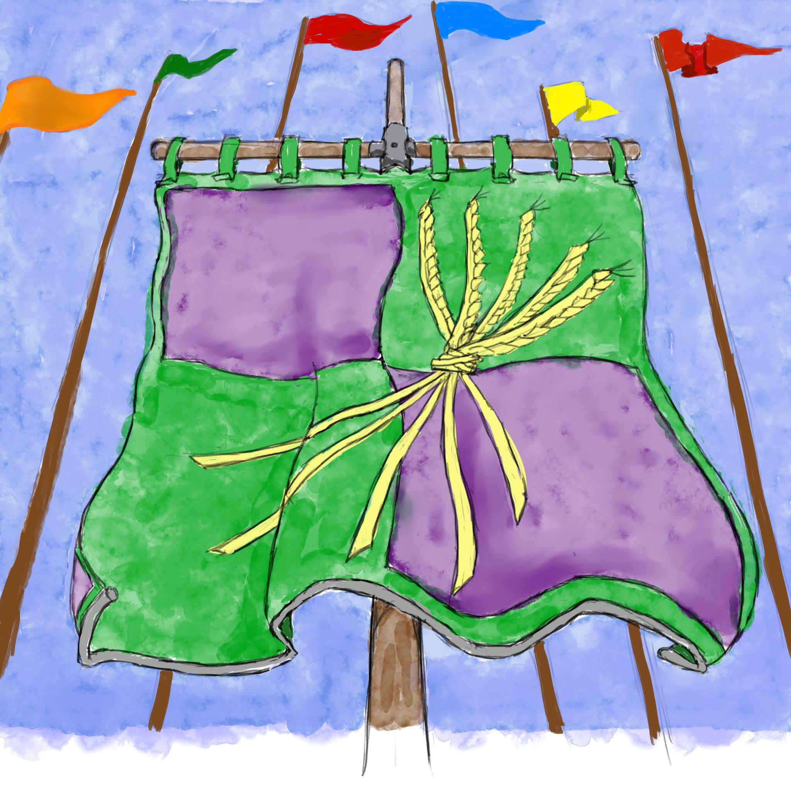

# About the Game

This is an early alpha of an open-source fantasy RPG.

We're working on it.
We've got a lot of the mechanics in a fairly good place, at least for what we want to do, and most of the "core" player options are present.
Now we just need to take all the long bullet-lists and convert them to full English text.
And also write in all the background stuff that's in my (the lead author's) head but that has never been written down anywhere.

And make sure all the revisions and rule-versions are consistent.

And also add more player content and options.

We're working on it.

## Changes since last time:

- Removed Disable Device, because we've never used it.
- Initial import for CV's *Wolf-in-Wool's Flock*, AKA the Secret Army, and his Stormsword's Rest.
  - Stormsword's Rest has been waiting... how many years?
    I'm so sorry.

## To-Do

- revise items-and-down for new attack skills.
- Edit the example section to match the last like 3 revisions of changes, god.
- Update the Ratfolk entry to flow a little more like the Elven one.
- Lots more player options\!
  - I did the classes and powers and backgrounds that where
    interesting to me, but I really need to do samples for others
    too.
  - More Items\! Especially more magical items\!
- Change *Maneuvers* to maybe *Feats* as the name for martial powers.
- Convert “walk” and “run” movement to “base” and “full”, respectively.
- We need massive editing. I’ve been resisting, but it’s large enough that we can’t use it without some major clean-up.
- Rework the intro sections.
- Update the “bestiary” part, since it’s more-than-two rules revisions out of date.
  - Also, tag the things in it with a difficulty hint.
  - And add Sinestro’s Cold Shadows and Sauce’s Whisps.
- Fill in the *Raptor's Protectorate* and the *Shaded-Sea People*, dear god.
- Add examples for all the skills.
- Add optional rules for ranking profession skills by wealth?
- Copy over a bunch of the finalized names, dates and units.
- fill in the stubs in *travelling* and *common hazards*.
- Fill in the *Secrets* section.
- Finish updating the *From-the-Authors* section,
  - including renaming the file.
- Right now, the *Basic Rules* chapter is... fucked up and mostly asides.
  - And right now the definition of "basic proficiency" appears to be in a side-bar, which isn't ideal.
- Write the rules for *recovering raw materials*; I'm thinking scrounging, "gathering professions", and breaking things down.
  - And fix the time-table for producing recipes; it's out of whack right now.
- Added CV's banners!

## Editing Notes

- I need to go through and use the term Tag consistently. And then also re-work most entries to use Tags.
- Likewise, use “Check” consistently, as opposed to “Test”.
- I’m trying to use “the character” or “a character” consistently, to emphasize that players and NPCs use the same rules. I need to go back and edit this to be the case.
  - Sometimes this results in tortured language, I might need to reevaluate.
- I’m trying to use “they” in cases where gender is unknown or unspecified. I *really hate* the “pick an arbitrary gender” writing style that many d20 systems use.
- I’d like to use lower-case for race names (“orc” and “elf” instead of “Orc” and “Elf.” I was using caps for a long while tho, so much editing will be required.)
  - I give up, I'm going back to caps-ing race names.
- It’s spelled “orc” by the way.
- At least for now, I’ve decided on just calling it *magic*. I wanted to use something a little fancier, like *essence*, but I couldn’t come up with something I wanted to commit to. I’m using the terms *mage* and *spell,* *psion* and *sleight*, and *priest* and *boon*. I may revisit this.
  - I’ve specifically avoided using “arcane” as a description, because it annoys me that a generation of grognards are growing up who think that that word means “knowledge magic” and don’t realize that it actually just means “difficult secret.”
- Note: I need to use Emerald Plane, Ruby Plane and Worldspine consistently.
- We use colored highlighting\! We put sidebars and clarifications in teal, FIXME notes in yellow, examples in purple, playtester questions in salmon, and GM Guidance in green.    
  - There may not be enough difference between GM Guidance and most Sidebars to give them different colors.
  - Also, the two GM Guidance blocks so far are *really long*, so treating them like a sidebar might not work.
- ... does anyone know of a gender-neutral replacement for words like "craftsman" and "Swordsman" that won't also result in tortured language?
- I think I'm going to start using a "bold-at-definition, italics-at-reference" style for keywords.
  - I'll need to go back and reformat... a christing lot.
- For now, we're using the term *Movement Mode*.  We might change it to *Movement* later.

## Contributors

- Gleech: lead author
- Sauce: a list of powers, GMing for a test, A sample module (incl. Wisps).
- SeaVea: fort design, feedback on armor and weapons, new drake history. Milestone system. Large weapon rework.  The Terranaut Dwarves, their cave salamanders, and lots of help rewriting the Dwarves.  And further work on weapons (crossbow designs).  The Old Injury trait.  Lots of artwork that I will eventually post to the site.  Playing a Healer section.  A couple of military racial items.
  - Special credit to CV for the banners that have now (finally!) been posted!  They're amazing!
  - Also Stormsword's Rest and the Secret Army / Wolf-in-Wool's Flock.
- King K: the Gnomes, Drugs, help with rep networks. A map\!  The Mycenaean Dwarves.  The Congenital Defect trait.  The Knights of the White Tusk.  Proficiencies for *Athletics*.
- Sinestro: stealth powers, giving the barter system a good exercise, reworking the Orcs. GMing and testing, this website\!  The Certans (they're rad, thanks!)  The Brightfeathers.
- Misandry: helping to fill out the Shamblers.
- Runic: clever uses for fireballs. Lobsters\!
