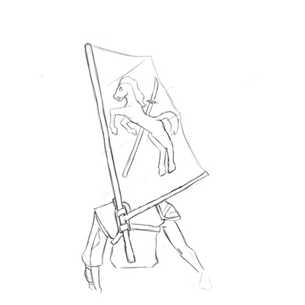

# The Shaded-Sea People

The Shaded Sea People are deadly raiders operating out of the Shaded Sea — a stretch of sea between the southwest Emerald Plane and the Warren Isles.
The Shaded Sea Peoples consist mainly of the Shade Elves of the Shaded Steppes and the Ratfolk of the Warren Isles, united as clients of the Leapers.

[[abstract]]
|
|A warlike nation of raiders, consisting of a the Shade Elves of the Shaded Steppes and the Ratfolk of the Warren Isles, united under the mysterious Leapers.
|
|---
|
|Population: 95M
|
|Common Languages: Keillou, Chatter, Shaded Speech, *the Leaper's language*, *subject languages*
|
|Common Races: Shade Elves (55%), Ratfolk (20%), *subject races*, Leapers (unknown)

## History of the Shaded Sea

### The Shaded Steppes

Much of the ancient history of the Shaded Steppes is unknown.
The Shade Elves of the Shaded Sea where already a dominant military power West of the Worldspine before settlers and explorers from the Commonwealth entered the region around CY 80.
They where a nomadic, warlike race of horse-riders and herders; they where dominant throughout the Shaded Steppes, and constantly raided and warred with the cultures that bordered on it.
They where fractious; an extended family formed a *clan*, clans formed *rides*, and rides joined in *confederations*.

Those nomadic horse-people had great access to milk, meat, and hide, but where dependent on settled peoples near the Shaded Steppes for everything else.
They where also warlike, and where devastating archers, riders, and raiders; they conquered several other cultures near the Shaded Steppes, forced others to pay tribute, and subject the remainder to nearly constant raiding.

They where unafraid to use extermination and terror as tools of conquest.
If a city or culture resisted, it might be razed and its population scattered or slaughtered.
(This could very somewhat by tribe and confederation, with some being more bloodthirsty than others.)
While this made their opponents more likely to surrender, it also bread intense resentment among their victims.

They where also brutal masters.
Their justice was harsh, with minor infractions frequently being met not only with the death of the perpetrator, but also a large enough collection of kin and neighbors to ensure that a message was sent.
Their duties where also extreme, often leaving client cultures impoverished and starved.
They frequently had no particular concern for clients' ability to survive, frequently treating them as possessions to be used.

Unsurprisingly, the Shade elves where hated by the other cultures of the south-west Emerald Plane, and had no shortage of enemies.

As the Commonwealth moved into the region, many saw a potential ally against a hated enemy.
(The Commonwealth's willingness to ally with other westerners against the Shade Elves also made these people more willing to allow the newcomers to built permanent cities and fortifications in the region; in fact, many of them seem to have been happy to allow the Commonwealth settlers to bear the brunt of the Shade Elf assaults.)
Slowly, a narrow strip of Commonwealth fortifications and walled cities began to stretch west, skirting the northern edge of the Shaded Steppes.

Further west, the Herders, a culture of hunters and herders from the central regions of the west, began to seek allies against the Shaded Steppes.
Though their territory did not border directly on the Shaded Steppes, the buffer between the two was thin; when the Shade Elves power waxed, their raids could reach well into Herder territories.
The Herders began to seek allies to resist the Shade Elves, and found willing partners among other nearby cultures — primarily including a confederation of Gnoll tribes.
This alliance became the aptly-named Herd-and-Pack Alliance.

Finally, in the east, based in a strip of forest running between the Shaded Steppes and the Worldspine, there where the Sunrise Peoples, an alliance of frequent enemies (and sometimes conquests) of the Shaded Sea.
Their fate was frequently the inverse of the Shade Elves: when the Shade Elves where united and their power was at its maximum, the Sunrise Peoples would suffer conquest and pillage; but when the Shade Elves leadership collapsed, the Sunrise Peoples broke free.
(Owing to their long history of conflict with the Shaded Steppes, the Sunrise People have a particular hatred for the Shade Elves.)

### The Warren Isles

The Ratfolk of the Warren Isles where a race of mariners, fishers, and traders.
It is unknown if the Ratfolk originated in the Warren Isles, or came there from somewhere else; in either case, well before the signing of the New Charter in the eastern Emerald Plane, the Ratfolk had used a variety of single-masted outrigger canoes to spread throughout the Warren Isles.

They established a number of distinct cultures.
Cultural differences slowly developed between islands; on some of the mountainous islands, it was possible for different valleys to be cut off enough from one-another that they could diverge culturally.
Though the Ratfolk practiced forms of agriculture and aquaculture, on many of the small islands, these where inadequate, and so the Ratfolk there relied heavily on fishing; many of these cultures built smaller settlements near the shores — sometimes even on stilts on the shore, or in the sea itself.
On some larger islands, however, agriculture was more successful; there, more urban, settled cultures developed.
Some of these urban settlements became city-states; some of the city-states became conquerors.

Ratfolk city-states began to experiment with seaborne warfare.
Large city-states began to conflict with one another, and to attempt to raid and subjugate the smaller cultures and islands nearby.
This began an exodus from the Warren Isles.
In CY 331, two smaller city-states on the island of *Katlkan* allied against the dominant city-state on the island, *Tetln*.
In response, *Tetln* sought the aid of the city-state *Oyssa*, on its own island 45 *dc* away; the alliance was able to pacify the smaller city-states.
Solidly in control of *Katlkan* and having the support of its closest rival, they then began the systematic conquest of the rest of the nearby Warren Isles.
These conquests triggered an exodus; Rafolk fleeing the *Tetln* conquest landed in the Haven Isles, on the shores of the southern Worldspine (and just south of the Shaded Steppes), and on the northwest Ruby Plane.

### The Shaded Sea Unites

By CY 200, the Commonwealth had established a number of forts and settlements in the region, and been integrated into its politics.
In CY 255, the Commonwealth encountered the Herders, and the Herd-and-Pack Alliance; the two cultures where natural allies, and not least because of their shared enemy in the Shade Elves.
Over the next century, conflict with the Shade Elves steadily increased; around CY 287, two of the largest Shade Elf confederations merged, forming the *Alenaya Confederation*; this combined entity unleashed a massive army on the region.
In CY 341, the *Alenaya* set their sights on Five Rivers, the largest city of the Herd-and-Pack Alliance (which the Herders called *Kauhnahei*); the Herd-and-Pack Alliance sought the aid of the Commonwealth, who deployed the Bonfire Legion — one of the Commonwealth's armies in Westward — to reinforce Five Rivers.
Between 341 and 344, Herd-and-Pack and their Commonwealth allies repulse several Shade Elf sieges; suffering heavy losses, and without pillage or tribute, the *Alenaya* Confederation began to crumble; as their power waned, the people on the east of the Shaded Steppes, the Sunrise People, began to rebel.

As Shade Elf power crumbled, the *Leapers* struck.
Little is known outside of the Shaded Sea about their methods; as far as is known, the Leapers never raised an army and marched on the Shade Elves.
It is theorized that they systematically harried the crumbling *Alenaya*, attacking their people as they spread out through the steppes to graze; they may also have found eager allies (or pawns) among the confederation's many enemies.
By CY 346, the *Alenaya* had lost the allegiance of all but their original two confederations — and these where in a weakened state, having lost many of their constituent clans to defection and combat.
They became tributaries of the Leapers.

In CY 349 the Herd-and-Pack Alliance signed a treaty with the Commonwealth, and by CY 350 the Commonwealth had begun to settle the Haven Isles.
During this time, from CY 346 to CY 351, the Leapers continued their subtle campaign, bringing most of the other Shade Elf rides under their control.
Though weakened, the Shade Elves where finally (mostly) unified; in CY 357, they set out to reconquer the east of the Steppes, and by CY 361, they set out to bring the Warren Isles under their control.

The Ratfolk that had landed on the shores of the Shaded Steppes in CY 331 where not unknown to the Shade Elves.
Skilled in seaborn combat, they became tributaries and allies of the Shade Elves, and feared raiders along the southern coast of the Emerald Plane.
As the Shade Elves weakened, they became as much allies as tributaries to the Shade Elves, equal to some of the rides in power; at some point before CY 361, as Shade Elven power began to recover, they proposed to ferry members of an allied Shade Elf ride to their former homes in the Warren Isles.

The scale of these raids where limited by the Shaded Steppes rafolks' numbers; they began almost thirty years of conflict between the Shaded Steppes and Warren Isles.
Between CY 363 and 366, the Shaded Steppes had subjugated nine smaller islands in the northeast of the chain; between CY 374 and 376, a concerted counter-attack by the Warren Isles ratfolk displaced the invaders.
In CY 377, a larger invasion secured more than a dozen islands; by CY 379, the invaders had once again been displaced.
Over the next decade, the Shade Elves and Ratfolk of the Shaded Steppes assembled a much larger force; in CY 389, they once again landed in the Warren Isles, this time with much greater numbers — and possibly with Leaper aide.
After six years of sustained warfare, in CY 395, the Leapers invaded *Tetln* and their allied city-states from below and conquered them.
The Ratfolk of the Warren Isles became tributaries of the Leapers.

In theory, the peoples of the Shaded Sea — the Shade Elves and Ratfolk of the Shaded Steppes and the Ratfolk of the Warren Isles — where now united under the rule of the Leapers; in practice, however, they where not a unified force.
The Leapers did not establish any kind of administrative structure, no one confederation had control of the Shaded Steppes, and *Tetln*'s rule of the Warren Isle had been shattered.

### The Siege of Islandhome

## The Shade Elves of the Shaded Sea

The Shade Elves of the Shaded Sea are a culture of nomadic herders and raiders based in the Shaded Steppes in the southwest of the Emerald Plane.
When not martialled for war, the Shade Elves are scattered throughout the shaded steppes, broken into small families and managing herds of horses, cattle, sheep, uncle's-goats (a breed of goat descended from mountain-goat ancestors), and *ahella* (a larger and more social cousin of the *bhalla*).
This gives them ready access to meat, milk, hide, and wool, but little else; everything else, from fruit to plows to medicines, they must acquire from the settled peoples they herd past, either through trade or raiding.
When martialled for war, the Shade Elves can quickly form into a powerful raiding force – depending on the ability of a *Warlord* to martial clans and confederations to their cause.
Because the Shade Elves have an excess of horses and cattle, they can cover enormous distances at speed, especially in the open ground of the shaded steppes; this, combined with a mastery of mounted warfare (especially the lance and short-bow) and brutal discipline, can make them into a terrifyingly effective military force.

Their ability to convert nearly their entire adult male population into a mounted military force, combined with centuries' experience with mounted warfare, makes them one of the Commonwealth's chief rivals, despite their small territory and population.

### Life in the Steppes

When not riding the war, the Steppe-Elves are broken into 

## The Ratfolk of the Warren Isles

The Ratfolk of the Warren Isles are a culture of fishers, raiders and pirates.

## The Leapers

## The Minotaurs

## The Foxfire
