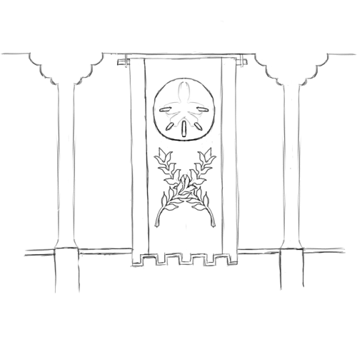

# Foam-and-Cloud

Foam-and-Cloud is a Goblinoid government spanning part of the Horizon Islands — an island chain in the Great Gulf.
The chain has three large islands; one has recently been claimed by the Commonwealth, and has been substantially fortified, while the other two — and most of the smaller islands of the chain — have been claimed by the Turquoise Kings, the Kings of Foam and Cloud.

[[abstract]]
|
|A Goblin kingdom in the Sea of Strife between the Emerald and Ruby Planes; they have been changed radically by assimilating values and customs from their Commonwealth subjects.
|The High Road operates here with impunity.
|
|---
|
|#### Major Character: the Sand-Shelled King
|
|The Sand-Shelled King is the current king of the Kingdom of Foam and Cloud.
|He is the latest in the line that founded the Kingdom more than two hundred years ago, the line of the Kings-of-Bronze.
|
|Despite being a Goblin king, he speaks fluent Commonwealth Standard, and is sympathetic to the Commonwealth.
|
|---
|
|#### Major City: Hurricane
|
|Hurricane was the largest of the cities founded by Goblin settlers; it was the city where the Bronze King made his home, and established his throne.
|The Bronze Kings have since moved their throne to Winds-of-Gold, but Hurricane remains a cultural center for the Goblin population on the island; it is still strongly aligned with the Bronze King.
|
|It is located in the southeast of Cloud Island, and has a population of 350,000.
|
|#### Major City: Winds-of-Gold
|
|Winds-of-Gold was a large, wealthy city on the southern coast of Foam Island; it was the third city to fall to the King of Bronze, and the second to accept tribute to end his seige.
|The Bronze King was carful to ensure the quick recovery of the wealthy city and its profitable markets; it has since become the largest city in the islands.
|The Fourth Bronze King moved his throne to Winds-of-Gold in CY 651, and the city is still the capital today.
|
|The city sits on the south shore of Foam Island and has a population of 550,000.
|
|---
|
|#### Languages
|
|Countless languages are spoken in this small island kingdom.
|Commonwealth Standard (Any), Heartland Gnoll (GR), and Weal (HHED) are all common in Commonwealth-descended communities.
|High Goblin (HHED+GR), Speech-of-the-Lesser (Any), and Vulgar Goblin (HHED+GR) are all common in Goblin communities.
|Commonwealth Standard and Vulgar Goblin are the two most common languages.

## History of Foam-and-Cloud

Nearly four centuries ago, between CY 534 and CY 561, the islands where settled by both Commonwealth and Goblinoid explorers; at the time, reaching these islands was difficult, and the colonies had little support from their parent cultures.
Conflict could be fierce, but it was also limited; neither side had substantial military resources, and the Goblins where outnumbered.
In fall of CY 559, the Goblin politics shifted violently against the King of Bronze, who collected what remained of his holdings (and the handful of fighters he could convince to defect from their various Warlords), and departed the Emerald Plane entirely; he arrived in the Horizon Islands scarcely ahead of winter.
Over the course of winter, he quickly assumed control of the Goblinoid settlements in the Horizon Islands; when Spring came, he launched a campaign against the Commonwealth settlements.
Through a series of sieges and campaigns, he was able to subdue all of the Commonwealth settlements by CY 568 — some he took out-right, though others he forced into tribute.

The King of Bronze did not loot or despoil those cities.
He could not count on the mainland for supplies, and he did not have complete control of many of those cities — and, perhaps wisely, he knew that the Commonwealth cities had more vibrant economies than the Goblin ones, and he wished to keep those economies intact.
Instead, he allowed those cities to continue much as they always had — notably, exempting them from slavery under the code — so long as they accepted his rule, and payed his tribute.

This arrangement has evolved over the centuries.
The Standard-speaking and Goblin-speaking societies have cross-pollinated extensively; notably, the Commonwealth-descended population proved to have notably better education and administration systems, and so the Bronze Kings came to rely almost exclusively on Standard-speaking administrators and scribes — with the notable exception of the Code, which is still solely the province of Goblins.

The Standard-speaking, Commonwealth-descended communities grew more rapidly than their Goblinoid counterparts; over the next 20 to 30 years, they became the major source of local production, wealth and food for the Bronze Kings.
The Goblinoid communities, in turn, became more divided: some Goblins adopted some of their Standard-speaking neighbors' customs and values, and began to prosper with them; other, more conservative Goblins saw their power erode.

As ocean-going technology became more sophisticated, trade with the Emerald Plane increased — with both the Commonwealth and the Goblin Kings.
The Islands' Goblin King and Code-mediated trade system made trade with the Goblin Kings on the Emerald Plane more favorable, and provided a mechanism for conservative Goblins to retain wealth and power.

As the Goblin Empire's pillaging of the Ruby Plane has accelerated, one might expect the Goblin Kingdom of the Foam and Cloud to become an important and prosperous cross-roads of the Empire — but that has not happened.

## Slavery under the Turquoise Kings

Part of the arrangement between the King of Bronze and the Commonwealth communities who surrendered to him was that their citizens would not be taken as slaves; the King of Bronze honored this agreement, and, under his descendants' rule, the fate of slavery in the Horizon Islands has waned.
As some Goblin communities where influenced by Commonwealth customs — and as the Commonwealth-descended communities have grown wealthy and productive, and have become vital to the fortunes of the Kings of Bronze — opposition to slavery has grown stronger and stronger, and the institutions of slavery have eroded.

In CY 577, the King of Bronze formally restricted the taking of slaves from any of the islands' Commonwealth communities; in CY 586, he passed laws restricting the abuse of slaves; through CY 591 to CY 617, his daughter passed further reforms governing the treatment of slaves; and in CY 651, the Bronze King's great-grandson restricted slavery on the island only to those whose parents where already slaves, or who came from the Goblinoid Kingdoms with their owners — a condition that applied to fewer than a 800 people on the island.

Under these rules, the only remaining slaves on the islands are those who come from the Goblinoid Kingdoms on ships, and a small population of Halflings living in a traditionalist enclave on the Island of Cloud — the southernmost of the two large islands in the chain; they are effectively forced into servitude because they are the only Halflings in the island — they must either marry into slavery or die out.
They live deep within large, defended Goblin manors, jealously guarded against the outside; so isolated, they serve an almost symbolic role.

They are guarded so jealously because the High Road operates almost freely on the islands; they enjoy wide support among both the Commonwealth-descended and Goblin communities, and the tacit approval of the current King of Bronze.

[[hook | Plot Hook: The High Road and the Turquoise Kings]]
|The Kingdom of the Foam a Cloud is a battleground in the High Road's fight against slavery, and this provides countless opportunities for adventure.  Players can liberate slaves, slay slaveholders, steal into the Goblin Empire, pick up valuable intelligence, and more.
|
|Though the number of Goblin families left that still hold slaves is few, they are wealthy and powerful — making them excellent villains.

## The Kingdom of Foam and Cloud

The Kingdom of the Foam and Cloud is a Goblinoid Kingdom; the Turquoise Kings have a seat in the Noble Assembly, and their Goblin communities are ruled by the Code — the title *Turquoise Kings* itself is derived from a series of carved turquoise chips commissioned in CY 694 and given to the School of the Code on the Island of Cloud.

It is an unusual Kingdom.
In CY 703, the first Turquoise King voted against the formation of the Empire, and — though they are still Goblin Kings, subjects of the Code — they have not contributed to the Empire or accepted its rule.
Slavery has almost been extinguished there, with the full support of the islands' Judges.
Though they still trade with the Goblin mainland, many merchants will not sail to the islands — out of fear that their slaves will be seized and liberated.

The culture there is neither purely Goblinoid nor Commonwealth; it is a hybrid that has been forged over more than 250 years.
Commonwealth Standard, Vulgar Goblin, Speech-of-the-Lesser, Weal and Heartland Gnoll and more can all be heard in the kingdom's lively markets; Goblin scholars of the Code argue law with the elected leaders of Commonwealth communities; and Goblins, Gremlins, Humans and Gnolls dine together on feast-days.

[[gmguidance | Using the Kingdoms of Foam and Cloud]]
|Full of allies even though it is nominally enemy territory, the Kingdom of the Foam and Cloud is very useful in intrigue-focused games in the Goblin Empire.
|In particular, it makes an excellent starting-point for an adventure into the Goblin Empire: Commonwealth Standard is spoken there, commonwealth currency spends there, and its easy to sail from the Kingdom to Goblin holdings on both the Emerald and Ruby Planes.

Their king is a most unusual Goblin King.
Like much of his line, he speaks fluent Commonwealth Standard, and is an avid consumer of the Commonwealth's culture; indeed, he picked "Sea-Plated King" as his name in Standard, as an homage to the "Sea-Scaled King," a character from a popular play in the Dragonshire.
He also embraces many of the Commonwealth's values, and openly pursues trade with them.
He is also no friend of slavery: it is widely believed that he will completely outlaw slavery before passing rule to his chosen heir, his second son.
The High Road also operates freely in his Kingdom; though he does not patronize them directly, he makes no attempt whatever to restrain them, and provides no solace or comfort to slave-holders or slave-catchers.

[[gmguidance | Using the Turquoise King ]]
|The Turquoise King is likely to be highly sympathetic to a player party operating in his Kingdom, providing them with a powerful advantage.
|He is not a supporter of the Empire and he detests the practice of slavery;
|while he likely cannot openly support the player party — he is constrained by the conservative flank of his court, who are still wealthy and powerful — he will also make little or no effort to restrain them on their likely missions.
