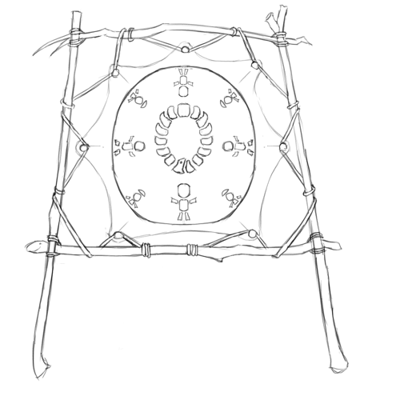

# Deep-Explorer Dwarves

Deep-Explorer Dwarves are an offshoot of the shallow-digging Dwarven culture of the North; highly individualistic, they fled their kin when the Mindsharing movement began.
"Deep-Explorer" is their formal name in Commonwealth Standard; they are also sometimes called Caver Dwarves or Ground-Explorers, and their name for themselves is *Drahrat*—a swipe at the Mindsharing Dwarves, or *Fahrat*.

[[abstract]]
|
|An enigmatic Dwarven culture that lives in caves deep underground; their extent of their settlements and resources is unknown.
|
|---
|
|#### Notable Outpost: Shade-Root
|
|"Root-of-the-Shade-Tree" is the (awkward) formal name in Commonwealth Standard of a small Dwarven outpost near Triumph; it is often shortened to Shade-Root.
|The entrance to the outpost is at the end of a small natural cave that branches off of the Carved Road.
|
|The outpost is a maze; though (some) of the walls have been bricked-over and (some) of the floors have wooden platforms and walkways, the outpost is still built within the confines of a twisting, turning natural cavern.
|Their front gate turns back on itself before leading to a main cavern 90 *strides* \[75m\] across; small shops and residences surround the walls: some may be free-standing structures, though others are merely facades over cave entrances.
|
|As is usual for a *Drahrat* settlement, visitors are not allowed outside of the "main" cavern; the full extents of Shade-Root are unknown.
|It is unknown how the outpost acquires (or produces) food, how they get out of the cavern (they make little use of the Carved Road), where their stores are kept, or even how many *Drahrat* actually live there.
|
|---
|
|#### Languages: Drahrat
|
|The Drahrat speak their own language, which developed from *Ehanud*, the Dwarven language spoken by the confederation of holds form which they departed.
|
|*Group HHED*
|

## History of the Drahrat

Early in CY 509, a psychically-reactive fungus was discovered underneath an island in the Haven Isles; experiments with this organism eventually spawned the Mindsharing Dwarves, or the *Fahrat*.
This new Dwarven sub-culture was greeted with extreme skepticism by some; among the most extreme were the movement that would become the Deep-Explorer Dwarves — or *Drahrat*—who vanished into the depths to flee their Mindsharing cousins.

The Deep-Explorer Dwarves originated in the *Lun*, a federation of several Dwarven holds dug into the low peaks at the northern end of the Worldspine Mountains.
They where (and still are) relatively insular, and where not among the Dwarven clans that joined the Commonwealth.

Descendants of another confederation 9 *demarc* \[38km\] to the East had left more than a century prior to settle in the Haven Isles, and it was there that psions and philosophers studying the *Fahra*, the mindsharing fungus, settled.
As the properties of the Fahra where explored, and as a movement began to develop around it, the insular and individualistic *Lun* began to fear what the *Fahrat* might become, and began to seek escape.
Their fear was great enough that they sought a shelter that the *Fahrat* could never breach, even if they should consume the entire surface: they dug into the depths.

The *Drahrat* began to explore the depths in CY 517.
More of their civilization moved underground over the following decades: by CY 533, their culture had mostly moved underground.
Their surface settlements, now highly fortified, where little more than trading posts and support hubs.

Little more is known about the history of the enigmatic *Drahrat*.

## The Drahrat Today

The *Drahrat* reveal little of themselves, and little is known about them.
It is unknown where or how the *Drahrat* produce or acquire food; how they travel form settlement to settlement; where their stores are; how they acquire or produce the goods they trade; or even how many of them there are or where their populations reside.

The Drahrat have breached the surface at several other far-flung points; like their former homeland, these constructions are heavily fortified and lightly populated, serving as little more than trade-posts for surface dwellers.
The Drahrat have also constructed outposts near the settlements of other subterranean races, notably near several Clay Men holds and Kobold cities; trade with these outposts provide other races' only insight into the Drahrat society.
All known Drahrat settlements are built in natural caverns, with little artificial excavation.
They also make heavy use of natural materials — and, conversely, little use of worked materials.
Drahrat settlements are constructed out of wood, plant matter, hide, bone and scale — and with little use of metal, glass or carved stone.
One notable partial exception is a type of brick that they make by preparing and baking a fungus-root; it is believed that this is intended as a deliberate insult to the *Fahrat*.

Though the *Drahrat* are willing enough to trade with other races, outsiders are not allowed outside of their market-squares.
They often offer exotic natural materials for trade, like those they use in their own construction: strange foods, unusual medicines, and the bones, hides and scales of unusual creatures.
They also offer goods acquired from far-flung cultures, although how they move goods from the Ruby Plane to the Emerald Plane (for example) is unknown.
The *Drahrat* have also mapped extensive networks of caves, and sometimes offer the use of these caves in trade.

They appear to have some mechanism that allows them to pass under the Worldspine mountains, and to reach the Haven Isles and Ruby Plane as well; whether they have dug their own underways (like those constructed by Kobolds) or have built something like the Commonwealth's Kairne Network — or perhaps a mix of both — is unknown.
It is suspected that they have a larger population that they have revealed, that they have access to water and some kind of farming, and that they have larger cities that they have not revealed — although whether this is true and what form any of them may take is unknown.

[[hook | Secrets of the Deep-Explorer Dwarves]]
|
|Obviously, the secrets of the Deep-Explorer Dwarves are rife with plot-hooks.
|
|* If the Leapers find a way to breach the Deep-Explorer Dwarves unknown transit method — be it a tunnel like the Kobold's Underway or a Kairne-like network — then every *Drahrat* settlement might suddnely become a Shaded Sea People invasion-corridor.
|* Less dramatically, if the Leapers take a *Drahrat* settlement, then they might have access to the *Drahrat*'s unknown transit-path; the *Drahrat* may turn to the Commonwealth for aid in fighting off this common enemy.
|* A hook that goes back before role-playing games existed, the *Drahrat* may find something deep underground — something dangerous, something they can't control.  This might be as simple as a giant flaming monster, as insidious as a mysterious organism taking them over (ironically enough), or as strange as an ancient carved totem of inscrutible power and origin (or some other out-of-context problem).

The full extent of their military resources are unknown, but their defences appear impressive.
In CY 795, a Shaded Sea raiding party broke into the Carved Road and attacked the settlement of Shade-Root (see above); this allowed several Commonwealth traders caught in the settlement's market a rare glimpse into the *Drahrat*'s formidable defences.
Like almost all *Drahrat* settlements, Shade-Root is built into natural caves, with very little artificial excavation; because of this, every passageway is narrow and twisting, lines of site are limited, and there are countless natural choke-points.
When the attack occurred, the *Drahrat* ruthlessly exploited these natural defences by blocking off these narrow passages and blind curves with massive shields mounted on wheeled carriages; they then fired repeating crossbows from behind these fortifications.
Invaders struck by these bolts fell rapidly even when their wounds where minor, which lead some of the witnesses to suspect that the *Drahrat* where using poison.
