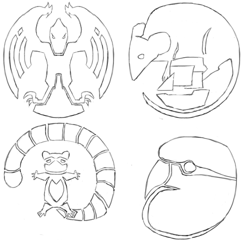

# The Raptors Protectorate

The Raptors' Protectorate is, like the Commonwealth, a vibrant alliance of many peoples, and the strongest (native) nation on their Plane.
Unlike the Commonwealth, however, they are not an enlightened alliance of peaceful expansion and voluntary inclusion; instead, they are an alliance of necessity, formed centuries ago to resist raids by the Shaded-Sea People, and now absorbing the refugees created by the Goblin Empire's conquest of the Ruby Plane.

[[abstract]]
|
|An alliance principally formed between the Raptors and Ratfolk of the Ruby Plane to resist the Shaded-Sea Peoples, now being joined by other minor nations and absorbing waves of refugees from the Goblin Empire's conquests.
|
|---
|
|Population: 135M
|
|Common Languages: Protectorate Standard, Brook, Ember, Songspeak, *refugee languages*
|
|Common Races: Raptors (63%), Ratfolk (13%), Brightfeathers (6%), *refugee populations*

## History of the Raptor Empire

### The Raptor Empire

The Raptors have long been the dominant race throughout the mountainous jungles of the central Ruby Plane, divided into diverse tribes and cultures.
Around CY 40, the *Terrace-Builder* Raptors built their first large cities in the northeast regions of the Raptor's Peaks, the mountain-range at the center of the Ruby Plane.
They mastered the construction of terraces, and use them extensively both for urban construction and agriculture.

The early settlements developed into city-states, supporting a highly-structured society.
They were broken into *castes*: roughly, *rulers*, *administrators*, *soldiers*, and *farmers*.
Their society was controlled by *rulers* and coordinated by the *administrators*.
All land was held by the *rulers*, and granted to villages and their *farmers* for use; food was collected by the *administrators*, stored in a vast network of storehouses, and distributed to the populace as needed.
The *soldier* caste served a role much like the Guards do in the Commonwealth: a small cadre of full-time warriors, who patrol and secure the Terrace-Builder's territory during peace-time and serve as the disciplined elites at the core of their army during war-time.
(Notably, within these castes, their also existed specific roles and sub-castes; for example, temple-heads where drawn the *ruler* caste, while their attendants and minor priests would be drawn from the *administrator* caste.)

> **Eager**: Because we have a ruling caste, you might think that our city-states work like throne-cities in the Kingdoms of Men; actually, they work a little more like the city-states of Heartland Province.
> Although they often have one main ruler, like a queen, that ruler typically shares power with the rest of the *golden caste*, who serve as officials and minor nobles.
> My people tend to be very good at making sure that everyone is "bought in," and so the kinds of palace intrigues that you see in the Human and Goblin Kingdoms are rarer among the Terrace-Builder Raptors.
>
> **Aryn**: "Golden caste"?
> The rulers, I guess?
>
> **Eager**: Yes, I'm sorry.
> "Ruler," "administrator," "soldier," and "farmer" are what the castes are called in Commonwealth Standard; we call them *golden*, *clay*, *bronze*, and *stone*.
>
> **Chandra**: Also, you said "queens."
> I guess your people are more matriarchal, like mine \[Drakes\] are?
>
> **Eager**: Yes.
> Like most of the Draconic races, females tend to be dominant in our society.
>
> **Notebook**: I'm curious, why are farmers the "stone caste"?
>
> **Eager**: Because we plant crops in stone terraces built into the sides of hills and mountains, often in and around our cities and towns.

The Terrace-Builders used a system of *corvee labor*: individuals where required to spend one out of every six days contributing labor to one of the city-state's projects; often, this meant either  constructing or maintaining roads and irrigation channels, or serving as a soldier.
(The Terrace-Builders use an 6-day week, with 5 days for labor and one day for rest.
A Raptor might be called for corvee labor on any given labor day; typically, the administrator-caste will schedule the local farmer-caste according to the needs of local projects.)

The Terrace-Builders also oversaw a system of communal resource distribution.
Individuals contributed their harvests, resources, and other goods to the city-states, who in turn pooled them in store-houses and distributed them back to citizens and subjects as required.
These store-houses where constructed throughout their empire and overseen by the administrator caste; goods where also transferred between them as-required.
This provided the Terrace-Builders with a vital reserve of food and a bulwark against crop-failure and famine, as well as an additional incentive for loyalty to the Empire.

Taken together, their system of corvee labor and their network of store-houses allowed the Terrace-Builder city-states to build a vast network of roads, store-houses and terraces, running throughout the Raptors' Peaks.

Eventually, an alliance of two Raptor city-states — Giant's Stairs and River-Cutter's City — came to prominence and, over the following centuries, slowly built an empire.
Their conquests where subtle: rather than marshalling their entire nation, as the Shade Elves often do, the Terrace-Builders used a mix of careful diplomacy, military threat, and small-scale skirmishes to slowly expand their influence and bring other city-states and peoples under their sway.

The Terrace-Builders where not destroyers: they where far more interested in seeing to the long-term strength and prosperity of their empire than they where in short-term plunder.
The Terrace-Builders rarely sought the total destruction, ruin, or conquest of their opponents, nor did they carry away slaves or loot cities; instead, they used military action as a tool for extracting tribute, trade, and other concessions, gradually bringing others under their influence.

(Notably, the Terrace-Builders often presented themselves as the lords of the Raptors, claiming that they could call up the Raptor tribes in the south and west.
In fact, those tribes had their own distinct cultures, and in many cases where just as much a conquered people as anyone else.)

Becoming a subject of the Terrace-Builders was not without benefits: it provided access to their extensive network of roads, and to the trade that they carried; it provided access to the protection of the Terrace-Builder Empire and the soldier caste; and it meant that Terrace-Builder storehouses would be built throughout the subject people's territory.
For these reasons, some nations became subjects of the Terrace-Builders voluntarily.
Even those peoples and territories who where conquered, however, where granted access to the benefits of being a subject of the Terrace-Builders; this was done in order to better integrate all the subjects of the Empire.

By approximately CY 390, the Terrace-Builder had assembled a substantial empire, centered on their city-states in the mountainous north of the Ruby Plane, and running north to the coast, east into the lowland jungles and deserts, and further south into the Raptor's peaks.
This empire consisted of many different subject peoples, some of which had been incorporated voluntarily, while others had not; this put the *rulers* caste in the position of managing a large, heterogeneous empire, whose subjects may not have been entirely subjugated, pacified, or assimilated.
In order to maintain control, they had to manage a careful mix of diplomatic, military, and economic pressures.
They also had to play the different parts of their empire against each-other, using one faction as a counter-weight to another — an art which the *rulers* caste mastered.

Unlike the Shaded Sea Peoples or Goblin Empire, the Terrace-Builders relied as much on the good will of their subjects as on military force to ensure the stability of their empire.
Because the Terrace-Builders never carried away slaves or looted cities, and because membership in their empire carried significant benefits, they where not hated by their subject peoples the way the Shaded Sea or Goblin Empire are.
(Of course, this is not to say that every subject people became a willing participant in the empire, nor that the Terrace-Builders where above deposing a troublesome monarch.)

### The Ratfolk Arrive

The Ratfolk had long lived in the Warren Isles.
They where excellent mariners; centuries before their exodus to the Ruby Plane, they had used a variety of small, single-masted outrigger canoes to expand throughout the Warren Isles.
They where a society fishers, farmers and traders.
Many of these cultures where small, and they where often quite distinct from one-another; in some cases, different valleys on the same island could have highly distinct cultures.

Beginning in CY 331, several larger Ratfolk cities united, and began the conquest of their neighbors; this started an ocean-born exodus, with many Ratfolk fleeing the Warren Isles.
Some of these exiles reached the southern Haven Isles, while others landed on the southern Emerald Plane, and still others landed on the northwest coast of the Ruby Plane.
Ironically, some of the Ratfolk who landed in the southern Emerald Plane became allies and tributaries of the Shade Elves; in CY 346, they ferried those devastating raiders back to the Warren Isles.
Shade-Elven raiding of the Warren Isles only intensified the Ratfolk exodus.

A large Ratfolk population came to settle on the northwest corner of the Ruby Plane.
These refugees brought with them a variety of distinctive but related cultures; they also brought relatively sophisticated technology — unlike much of the Ruby Plane, they had mastered the use of iron, for example.
Many of these cultures where mercantile; settled on the Ruby Plane, they began to heavily exchange, and to further develop.

This area was far from the borders of the Raptors' Empire, and was only sparsely populated — they where separated from Giant's Stairs and River-Cutter's City by a thick jungle, and then by rugged Raptor's Peaks.
Over time, a unique Ratfolk culture developed, with their own cities — notably, this culture was more urban and agrarian than their island-bound kin.
This culture made allies among the locals — including the Brightfeathers, a parrot-like race that lived in the lower, jungle-covered reaches of the northwest Raptors' Peaks.

Eventually, the Ratfolk began to trade with several of the Raptor tribes that lived in the southwest flanks of the Raptor's Peaks — tribes that where tributaries of the Terrace-Builders' Empire.
This brought them into (indirect) competition with the Terrace-Builders, as they where weakening the Terrace-Builder's hold over the Raptor tribes, and thus reducing the Empire's potential military might.

### The Shaded Sea Attacks

In CY 454, the Shaded-Sea People — the Ratfolk of the Warren Isles and the Shade Elves of the Shaded Steppes, united under the Leapers — began to attack the northwest Ruby Plane, falling most heavily on the Ratfolk there.
The Ruby-Isles Ratfolk sought out the aid of the militarily powerful Raptor Empire, offering to become tributaries if the Empire would protect them.
The Raptor Empire, long used to juggling a vast empire of only weakly-bonded peoples, offered the Ratfolk favorable terms: military aid, in exchange for the Ratfolk's nominal submission, and access to their prosperous markets.

The Raptor Empire marched west, and helped the Ratfolk resist the Shaded Sea raiding.
In 456, the Shaded-Sea Ratfolk had established a permanent military encampment on the Ruby Plane; by 477, the Raptor Protectorate had pushed the Shaded-Sea Peoples off the Ruby Plane entirely — though their seaborn raiding continued.

### Prosperity

For centuries, the Raptor Empire prospered; the terrace-builder Raptors cut roads through the mountains and jungles, and allowed goods to flow from the Ratfolk in the west to the Raptors (and their subjects) in the east.
The Terrace-Builder Raptor's society was dramatically altered; trade with the Ratfolk made them wealthier, and that wealth made them more mercantile.
While they maintained their system of resource-sharing and corvee labor, they came to pay their citizens a small wage collected from trade, allowed their citizenry to accumulate personal wealth and goods, and even allowed some citizens to purchase their way out of their labor obligations.
In turn, influenced by the Ratoflk, a distinct class of *merchants* and *artisans* developed, trading with other nations and practicing crafts imported from the Iron-Workers.

### Contact with The Goblin Empire

In CY 617, Goblins first established a settlement on the northeast Ruby Plane.
In CY 703, the Goblin Empire was formed, and they began their sack and conquest of the Ruby Plane in earnest.

As the Goblin Empire conquered their way inland from their foothold on the Ruby Plane, members of the cultures and races that the Goblins conquored sought the protection of the Raptors.
Soon, the Raptor Protectorate began to swell with the refugees of the Goblin's conquest.

### The Present

Today, the Raptor Protectorate is a wealthy and powerful civilization, the preeminent native power on the Ruby Plane.
They benefit from the military might (and deft politics) of the Terrace-Builder Raptors, and the mercantile skill, seafaring talent, and relative sophistication of the Iron-Worker Ratfolk.
The empire has also seen a massive influx of refugees from the Goblin Empire's conquest, which they strive to settle in the relative safety that exists within the Protectorate's borders.

The Protectorate faces powerful enemies on two fronts.
In the east, a devastating war with the Goblin Empire draws ever closer; so far, at least, the Goblin Empire has avoided direct conflict with the Protectorate, but their armies draw ever closer to the Protectorates' borders.
In the west, the Iron-Worker Ratfolk are subject to constant, devastating raids by the Shaded Sea Peoples.

## Administration

Unlike the Commonwealth, the Raptor Protectorate does not have a representative government or a sophisticated beurocracy; it is still, in principle, consists of the Terrace-Builder Empire and their dependant territories.
In practice, however, power is more widely-distributed, with the Iron-Worker Ratfolk holding significant power, and the 

## Cultures

The Raptor Protectorate is composed of wide variety of cultures from throughout the northern and central Ruby Plane — though its two dominant cultures remain the Terrace-Builder Raptors, who lead the Protectorate and provide most of its military might, and the Iron-Worker Ratfolk, who remain the drivers of their economy.

### The Terrace-Builder Raptors

The Terrace-Builder Raptors continue to use a distinctive system of terraces for agricultural production in the highlands of the Raptor's Peaks.
They also continue to construct and occupy some of the largest urban centers on the Ruby Plane.
Their systems of caste and corvee labor also survive — although they have changed.
Their leaders are still drawn from the *rulers* caste, and their administrators are still drawn from the *administrators* caste.
Members of the *soldiers* caste still form the elite troops of their armies; they are trained in war from their youths, and serve their city-states as labourers when the army is not active.
Farmers, in turn, work the terraced fields, and serve as craftsmen in rural settlements.

The inclusion of the Iron-Worker Ratfolk in the Protectorate brought profitable trade, and with it chnage.
The "tribute" that the Iron-Workers pay to the Terrace-Builders is minor, but profit from trade with them is significant; the Terrace-Builters also charge a tarrif on goods carried over the extensive network of roads that they maintain through the Raptor's Peaks at the center of the Ruby Plane.
Much as the city-states collected the agricultural product of the terraced farms and distributed food among their citizens, now they collect tribute and tarrifs from trade, and distribute this among their people — minus a portion claimed by the city-states themselves.
This means, in practice, that the city-states are well-funded, that the Terrace-Builders have become wealthy, that those doing corvee labor now receive a modest wage, and that a market for goods and artisenry has sprung up.

To encourage profitable trade and useful craft, most Terrace-Builder city-states allow members of the Soldier and Farmer castes to purchase an exemption from certain corvee duties.
This directly adds to the city-state's coffers, but it has also enabled the development of a profitable professional class of merchants and artisans within the Terrace-Builder's city-states, and enabled further trade with the distant Iron-Workers Ratfolk.

Two additional sub-castes have risen to prominence: *merchants* and *artisens*.
*Merchants* are a sub-caste within the *administrator* caste, engaged in the sale and exchange of goods with other cultures, both their own (for personal profit) and those of the sity-state; *artisans*, in turn, are a sub-caste of the *farmer* caste, and are responsible for mastering useful crafts.
As contact with other races and cultures has brought material surplusses and new knowledge, these castes have grown in their wealth and prominence.

[[fiction]]
|
|> "Corvee labor!"
|> The Terrace-Builders are the bulwark that protects the Ruby Plane from the Goblin Empire and Shaded Sea — and our likely allies! — so we'd like to think the best of them.
|> So we use a nice, technical term for it: "corvee labor."
|>
|> But it's slavery.
|> Someone from the Administrator caste shows up, backed up by some soldiers, and forces you to build a road through the steaming jungle.
|
|*Fire-Watcher, a scholar from the Dragonshire in the Commonwealth*
|
|> I can say I never thought of myself as a slave.
|> I think we thought of ourselves as citizens doing our duty, to maintain the roads that we travelled and the fields that fed us.
|> And I can point out at least one important difference between what I was, and what the slaves of the Goblins are: I was allowed to leave.
|
|*Eager, a Raptor who emigrated to the Commonwealth.*

Much ancient Terrace-Builder construction used fieldstones, though most major construction in modern city-states is done using carefully dressed stone masonry — often limestone.
The use of brick construction is also common, especially for minor buildings and in villages outside of citystates; they are often face with mudbrick.
Thatch is often used for roofing, and ornamentation is rare.

Raptor buildings are often designed for communal use.
Many buildings are large and open, without internal walls; sheets of thick fabric are used for doors and internal partitions.

In the mountains and foothills, the Terrace-Builders often lay their cities out in terraces; they often exploit natural defenses, building walls only at the entrances to valleys, for example.
In the plains to the extreme east of the Empire, they sometimes use a more regular, level city-plan, with walls all-around.

Raptors use a 6-day week, with the precise schedule varying by caste; for example, the Farmer caste works three days in the field and two days for the city-state, and has one day off.
The sixth day begins with a short ritual meal, but is otherwise left to the citizen.

Terrace-Builder Raptors have spent centuries riding herd over an empire consisting of diverse peoples; they tend to be very open, and they are welcoming to members of strange new races and cultures.
Members of countless different races can be found in the prosperous markets of the Terrace-Builders' city-states.
However, it is not easy for an outsider to find a permanent place in their culture: their caste system influences every part of their society, and it is not easy to operate among them without a caste affiliation (and an outsider — especially a non-raptor — cannot easily claim a caste).

### Iron-Worker Ratfolk

The Iron-Worker Ratfolk are a culture of skilled traders, sailors, fishers and metal-workers.
Their industry is one of the major drivers of the Protectorate economy; fish, crab, iron, and steel from the Iron-Workers is traded in markets throughout the rest of the Ruby Plane, carried along the coast by ships and across the mountains by the Raptor's roads.

They live throughout the northwest of the Ruby Plane, in large cities and small fishing villages.
Iron-Worker Ratfolk commonly build homes and small buildings on stilts; this allows them to build in wet lowlands, sometimes even on the shore or in the water directly.
Despite their expertise with iron, when they build near water, they frequently do not use metal nails; instead, they primarily use jointes and dowls, and replace parts of their homes as they weather.
On drier ground, they build more traditional homes — timber-framed, well-braced, nailed together, and faced with stucco so that they can resist rain and weathering — although usually still constructed on stilts, in order to handle heavy rains and runoff.
When they have enough dry ground to work with, Iron-Worker Ratfolk also build underground; at the extreme, they have been known to reclaim mine and quarry space for use as fortifications.
When Iron-Workers build underground, they often face interior surfaces in brick and stucco to seal out moisture, and often build narrow drainage-paths into their rooves and walls; their underground structures are often reinforced, in order to handle the added weight of rain-soaked ground.

Ironworkers have a great need for fortifications, as piracy and raiding from the Shaded Sea remains a constant problem.
Most settlements of any size have some kind of fortification, whether small wood-stake fortifications constructed by small communities on the coast, or large-scale sub-surface constructions with fortified entrances in higher ground.

Iron-Workers are experienced seafarers.
They use a variety of boats to sail the coasts for trade, and to venture into the sea to fish.
These include small canoes; to larger single-masted boats, like catamarans and outrigger-canoes; to larger, two-masted boats.
Even their larger, dual-mast boats have flat bottoms and a shallow draft, the better to navigate shallow coastal waters and land on shores.

## Economy of the Raptor Protectorate

## Military of the Raptor Protectorate

## The Raptor Protectorate and Other Nations

The Raptor Protectorate has no shortage of enemies: the Goblin Empire presses on the east, and the Shaded-Sea constantly attack the west.
Pirates from the Shaded Sea directly attack the Protectorate on its western shores, raiding Ratfolk and Brightfeather villages built on or near the shore;
