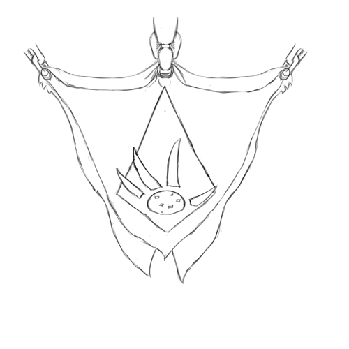

# The Goblin Empire

Goblins have long dwelled in the southeastern reaches of the Emerald Plane, their culture ruled by Kings and Warlords — and infamous for the sale and brutalization of intelligent beings as slaves.
Since the rise of the Dragonshire — and especially since the Kingdoms of Men reformed from the remains of the Empire of Man — the Goblins have been the weakest major power in the East.

Their fortunes have changed dramatically since the creation of the Goblin Empire and their conquest of the Ruby Plane.

[[abstract]]
|
|A society with several power-centers, all cooperating under the aegis of the Empire to plunder the Ruby Plane.
|
|---
|
|- Ruled by **Second-Empress**, the current Empress.
|- The Empire's capital (on the Emerald Plane) is **Strong-Throne**.
|- **Classical Goblin** (Group GR+DDK) is the language of law and governance, while **Vulgar Goblin** (Group GR+DDK) is the language in common use.  Meanwhile, **Speach-of-the-Lesser** (any group) is spoken by slaves and slave-tenders.

## Kings, Warlords, Emperors and the Code

Goblin society is ruled by Kings and Warlords.
Kings control cities, towns and territories — the means for food, industry and trade.
Warlords, in turn, control bands of Goblin fighters.
Kings jostle amongst themselves, forming alliances and competing for power, but they also compete for the services of warlords; kings' arrangements with warlords are openly mercenary — there is little pretense of honor, loyalty or higher causes — and they can be extremely fragile.

Unsurprisingly, rule in Goblin society can be extremely unstable.

This does not have as great an impact on Goblin society as it could, however, because law and commerce are not administered by their Kings; instead, they have a parallel legal system, founded in the Code, and administered by Judges.

### The Code

Originally called the *North Coast Code,* the Code was a formalization of the customs used to govern trade between several cities on the southern coast of the Glass Sea — the sea between the Kingdoms of Men and the Goblins.
Though it was only originally intended as a trading agreement between a handful of cities, it began to spread; though it doesn't claim to be ordained great spirits, destiny or fate, it has nevertheless come to occupy a central place in Goblin society.

The Code has evolved over the centuries; eight major schools of legal scholarship have developed, and each has accepted modifications to the Code itself — the Code never claimed to be unmodifiable, although no procedure for amending it was specified.
In general, there is little competition between Schools; Goblins tend to view each of the schools as being equally valid, thinking of them much like the way that members of the Commonwealth think of different provinces.

Judges as such are few: there may be only three or four in a city of five thousand.
They have the support of clerks, scholars, and Enforcers — though the ranks of the Enforcers will be fewer than the forces of local Kings and Warlords, they are numerous enough to enforce the Judge's judgments on the populace.
Those who appear before Judges can hire Advocates — scholars of the law who specialize in pleading before Judges.
Advocates' skills are highly valuable, and they are often important, powerful and wealthy members of their communities.

### Kings-by-the-Assembly

The Second High Kingship of the Kingdoms of Men (CY 361-435) was particularly warlike, and cost the Goblin Kingdoms heavily.
In CY 377, an unprecedented step was taken: several desperate northern Kings called their peers to an assembly, with the purpose of selecting one among their number to lead their combined forces, the better to resist the Kingdoms of Men.
In early CY 378, the First king-by-the-Assembly was appointed.

The First King-by-the-Assembly had the loyalty of most Kings — and could exploit the internal peace to buy most Warlords — and was able to rally stronger resistance to the Kingdoms; however, they where still overmatched.
The first King-by-the-Assembly served until CY 417.

The only other King-by-the-Assembly ruled from 541 to 563; the line ended when the king's daughter was assassinated less than 6 months after taking the throne.

The Third High Kingship of the Kingdoms of Men (CY 695), the peace between the Kingdoms of Men and the Dragonshire (beginning in CY 698), and the incorporation of the Dragonshire into the Commonwealth at the signing of the Commonwealth Compact (CY 744) spelled the end of the Goblins as a major power on the Emerald Plane; the new Commonwealth was far too vast, wealthy and powerful for the Goblin Kings to compete with.

### The Empire

Goblins hailing from southern kingdoms first sailed far enough south to reach the Ruby Plane in CY 538; they found in the northeastern Ruby Plane an arid land, populated by relatively primitive people — a land the could plunder, full of people who would be their slaves.
Goblin sailing techniques rapidly improved, and by CY 617 they had established a permanent outpost on the northern shore of the Ruby Plane.

In CY 703, the Noble Assembly once again appointed a ruler — this time an Empress.
She was given the power to assembly an Empire — to raise taxes, to build an Imperial administration, and to levy the forces of the kings and warlords and place them under her command.
She was given this power for the express purpose of efficiently conquering and plundering the Ruby Plane.

The Goblin Empire has seen a rapid rise in the Goblin's fortune.
They have conquered a large swath of the northeast Ruby Plane, displacing, enslaving or exterminating many of the native races in the process.
The territory on the Ruby Plane is now larger than their territory on the Emerald Plane — though they still rule this territory from the Emerald Plane.

In characteristic style, modern Goblin society has at least three centers of power, all of them cooperating only slightly more than they compete: The Imperial administration rules their society, but only so long as it has the consent of the Kings — that is, only so long as it enriches the Kings with treasure plundered from the Ruby Plane.
The Kings, in turn, try to keep the Empire on a short leash, giving it no more power than it needs to coordinate the conquest of the Ruby Plane.
And through it all, the Judges remain, ruling on matters of law and custom.

## The Economy — and Slavery

Slaves have long been one of the chief resources of the Goblin economy — the North Coast Code specifically granted Goblins the right to take any non-Goblin as a slave, and very few scholars of the Code have questioned this provision or called for change.

Acquiring slaves on their home plane grew more and more difficult as the other peoples and nations of the eastern Emerald Plane grew stronger; it effectively became impossible with the signing of the Commonwealth Compact, as they could no longer risk the wrath of the Commonwealth.

The Ruby Plane has become the chief source of slaves and plunder, and the economy of the Goblin Empire now revolves around the conquest and exploitation of the Ruby Plane and its people; this transformation has brought the Empire unprecedented wealth and prosperity.

## The Imperial Military

Goblin metal-working has long lagged behind that of the Kingdoms of Men and the Dragonshire; owing to their long talons, awkward hands, and stiff bone-plated backs, they have never been able to ride horses well; and the forces of Kings and Warlords are often highly heterogeneous — and almost always reinforced with slaves.
All of these factors have meant that the Goblin Kings have long lagged behind the other militaries of the Emerald Plane.

Still, they are not without advantages.
Several Goblin Kingdoms have cultivated expertise in chemistry, alchemy and medicine, and they have used these skills to turn their slave ranks into forces to be feared.

They have also used their time on the Ruby Plane wisely.
Though the troops levied from Kings and Warlords may vary widely in tactics, composition and quality, the Empire has reorganized them into regular units, drilled them, and deployed them together; this has led to rapid improvements in their coordination.
The Empire has also experimented with new technologies — they are the only power besides the Commonwealth to experiment with guns and cannons.

### The Infantry

Goblins commonly use large formations of infantry equipped with long spears or pikes.
The first two ranks carry shields: the first rank will fight kneeling, with their spears braced at their feet and their shields readied, while the second rank fights standing and holding their shield up — though also with their spears braced.
The ranks behind them fight with their spears or pikes held overhead, attacking by thrusting.

These pike-wielding formations can be extraordinarily deadly, but they are also very vulnerable if they are flanked; for this reason, support is essential.
The flanks of these formations are often guarded by ranks equipped with crossbows or hand-cannons — Goblins are not well designed for the use of bows, but they can use guns and crossbows effectively.

Goblins do not field heavy cavalry the way the Kingdoms of Men do — although they do field deadly light cavalry.
Gremlins do not have long talons interfering with their ability to grip, they do not have bony plates impeding their flexibility, they are light enough to ride two-to-a-horse, and — vitally — they can be trusted enough to play a vital role in a fighting force, unlike other slaves.
Gremlins ride two-to-a-horse, typically in light armor, carrying guns or crossbows; though they are almost incapable of mounting a charge like mounted human Knights can, they make deadly skirmishers and archers.
Because there is a separate jockey and crossbow-wielder or cannoneer, they can fire effectively while moving at speed; because they are so fast and mobile, they can close to a much shorter range without feer of being effectively engaged — even by enemy archers.
And because they are so lite and quickly, they are particularly effective at running down an enemy who breaks; this capability is very important, as it has allowed the Goblin Empire to turn many partial victories into devastating routes.
Sometimes, these light cavalry will carry man-catchers, nets, bolos and other weapons designed to debilitate and capture fleeing enemies; a future of misery and slavery awaits those so captured — and wealth and reward awaits the Gremlin who captures many future slaves.

When operating in smaller units, Goblins often field a single formation, of mixed pike-wielders and crossbow-wielders.
Each rank will be a mix of pikes and crossbows; in the first two ranks, the pike-wielders will also carry shields.
When the enemy is at range, the crossbow-wielders will stand next to the pike-wielders; the pikes will cover them with their shields.
As the enemy closes, the crossbows will step back into the pikes, who will close ranks in front of them; if the enemy engages the formation in melee, the crossbows will fight with their talons.
This requires careful coordination; if order collapses, the results are likely to be catastrophic.
The Goblin Empire drills these formation often, and is careful to arrange troop rotations so that all of their infantry have experience deploying these tactics in combat.

Though Goblin Kings have long made use of slave rabble in their military tactics, the Goblin Empire is less willing to do so; the loyalty and reliability of slaves recently acquired from the cultures of the Ruby Plane remain a serious concern.
Still, some generals do press slaves into service — especially members of larger and more battle-capable races; these slaves are often paid a wage and afforded better treatment, the better to secure their loyalty.

### Cannons, Hobgremlins and Other Experiments

For centuries, with few exceptions, Goblins have lagged behind both the Commonwealth and the Kingdoms of Men in military technology.
In an effort to close this gap, the Empire has been using the Ruby Plane as a kind of military laboratory, testing out new technologies and tactics against inferior enemies.

One such technology is the use of gunpowder weapons.
The Goblin Empire is one of two major powers in the known world to experiment with guns and cannons — the other one being the Commonwealth.
The Goblin Empire had hoped that these weapons would provide a powerful edge in their conquest of the Ruby Plane; while they have indeed been a powerful advantage, they have not provided the edge that the Goblins hoped.
Guns are powerful, but they are, in many ways, unnecessary: none of the races or cultures that they have conquered have made heavy use of heavy metal armors, so guns provide no great advantage over conventional bows and crossbows.
Similarly, though cannons *have* proved to be devastating seige weapons, the designs available to the Goblin Empire are not portable or wieldy enough to be effectively deployed against infantry; this limits the advantage that they provide in open warfare.
Cannons are also expensive, and impose a significant baggage train.

Hobgremlins are a more gruesome innovation.
Hobgremlins represent an attempt to close the gap in physical power between Goblins and other, larger races, without relying on (sometimes unreliable) slaves in battle.
Hobgremlins are alchemical creations, created by the magical, surgical and chemical manipulation of Gremlins; the procedure is gruesome, and the results are horrifying.

Hobgremlins are indeed much more physically imposing than Gremlins or Goblins; they are often as large as Gnolls, and even stronger and tougher.
They often possess other advantages as well, like potent natural weapons, venoms, thick hides or acute senses.
Horrifyingly, they are often mentally *reduced* as much as they are physically enhanced; the procedure is only useful if it produces warriors that the Goblins can trust and control more than a typical slave, so Hobgremlins are often mentally crippled, and conditioned to be loyal to their Gremlin tenders and Goblin masters.
This crippling can sometimes involve physically lancing parts of the brain, a procedure that leaves the Hobgremlin an invalid — if they survive at all.
The alchemical processes that create Hobgremlins can also be unstable; they may suffer deformity and illness — deadly allergies and strange addictions are common.

Though the process has not been completely abandoned, its use has declined — and it was never widespread.
One reason is that the results are unreliable; it can be frustratingly difficult to keep Hobgremlins healthy, and the damage to their minds limits their use on the battlefield.
Even more dangerous — though the Empire may never admit it — was the impact that it had on Gremlins in the Empire.
Gremlins where horrified by the process, and deeply resented the degradation being visited upon themselves and their kin — so much so that at least one Gremlin doctor involved in the experiments defected to the Ruby Alliance.
The Empire feared that, if the experiments continued, they might face a Gremlin uprising — a terrifying prospect, as the Empire is dependant on Gremlin slave-handlers to function.

Now, Hobgremlins are rarities, produced only by the most secure or most foolish Goblins.
Even more rare are similar experiments on other races; these rarely end well for the Goblins involved because, while the specimens created are powerful, they are also much less "sympathetic" to their Goblin masters than Trusted Gremlin slaves.

### The Navy

The Goblin navy is vital for connecting their territories on the Ruby Plane with their homeland.
This navy is primarily a defensive and logistical force — protecting their landings, ferrying troops and equipment from the mainland and riches back home.

## The Goblin Empire and Other Nations

While the Goblin Empire has made no peace overture to the Kingdoms of Men or the Commonwealth as such, they have avoided any conflict with those powers.

The Goblin Empire is, of course, an enemy of the Raptors' Protectorate, and the two are at war; indeed, the very mission of the Protectorate is to provide a safe refuge from the predations of the Shaded Sea Peoples and the Goblin Empire.
So far, however, direct conflict has been minimal: the Protectorate lags behind the Empire in technological sophistication and military capability, and so they have focused on securing their borders and integrating and arming their refugee populations.
(And there is still a substantial "buffer zone" of unfortunate civilizations between the Raptor's Protectorate and the Goblin Empire.)

The Commonwealth has been slow to form an alliance with the Raptors' Protectorate — they are slow to start a war that may consume half a continent on another's behalf — but sympathy for the Protectorate is strong in the Commonwealth, and relations between the two have been strengthening.
The Goblins know that such an alliance is coming, and that they may lack the diplomatic means to stop it; in recent years, they have begun to prepare to fight a war on two fronts.

Even though the Commonwealth has not yet formally allied with the Protectorate, they have long meddled in the affairs of the Goblin Empire — through spies directly commissioned by the Commonwealth Council, and through the tacit support of organizations like the High Road.

While some of the Goblin's kings have sought allies among the kings and nobles of the Eastern Kingdoms, such overtures have not yet been fruitful, and the Empire has not yet given them its official support; the southern Human Kingdoms have long been enemies of the Goblin Kings, and the Kings of the East are slow to forgive.

The Goblins have little contact with the Shaded Sea Peoples, as a continent separates the two (and because the Commonwealth patrols the seas between South-Harbor and the Ruby Plane, cutting off an ocean route).

---

## Major Character: Second-Empress.

Her name in High Goblin can't be transliterated, but in Speech-of-the-Lesser, she is simply called Second-Empress; she is the daughter of the first Empress.
She rules the Goblin Empire, and is leading their pillage of the Ruby Plane.
So far, she has successfully kept the Kings, Warlords and rising merchant class sweet, while slowly but steadily advancing the power of the Empire.

## Major City: Strong-Throne

Strong-Throne is the capital of the Empire, located in the south-center of Goblin territory on the Emerald Plane.
The city has a population of roughly 450,000, contains the Imperial throne, and is the center of their administration and military command.

## Major City: Market-of-the-Empire

Market-of-the-Empire is a city of more than a million located only 70 miles from the Imperial frontier on the Ruby Plane.
The city is not a seat of Imperial administration; rather, it is a center of trade and business; here, slaves and pillage from the frontier are traded for coin and supplies from the Emerald Plane.
Perhaps as few as 300,000 of the city's occupants are resident citizens; they are joined by another 300,000 traders, travellers and transients, and between 400,000 and 800,000 slaves.

## Language: Classical Goblin

Classical Goblin is a language of law, governance and scholarship; it is an ancient, formal form of the language, preserved in the written Code and used throughout the Goblin legal system.

Goblins have an unusually wide vocalization range, and their language spans all of it.
Few other races can speak it — which suits Goblin cultural values.

*Group GR+DDK*

## Language: Vulgar Goblin

Vulgar Goblin is the form of the Goblin language in use today.
Vulgar Goblin has borrowed from the languages of many of the races that they have encountered (or enslaved) over the centuries.

Conveniently, much like Commonwealth Standard, Vulgar Goblin often forms new words by combining existing ones; this means that many words and place-names can be nicely rendered in Commonwealth Standard.

*Group GR+DDK*

## Language: Speech-of-the-Lesser

Speech-of-the-Lesser is a language designed to be usable by a large number of races, with diverse types of speech.
It works much like Commonwealth Standard: it uses a number of abstract sounds, which speakers substitute for sounds that they can make.

Notably, Many Goblins do not speak Speech-of-the-Lesser — in their minds, it is not the job of the *greater* to make themselves understood to the *lesser*.
This task often falls to slave-tenders — often Gremlins or low-born Goblins — who speak to their betters in Goblin and the slaves they manage in Speech-of-the-Lesser.

*Any Group*
